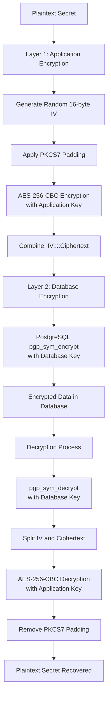

# Defense in Depth: A Production-Grade Approach to Protecting Sensitive User Information

:::tip TL;DR
This article demonstrates how to build a production-grade dual-layer encryption system combining AES-256-CBC and PostgreSQL pgcrypto to protect sensitive user data. You'll learn why single-layer encryption fails, how to implement defense-in-depth security, and understand the remaining vulnerabilities even in robust systems.
:::

In an era where data breaches dominate headlines and compromise costs continue to soar, protecting sensitive information has evolved from a technical consideration to a critical business imperative. According to IBM's 2024 Cost of Data Breach Report, the average breach now costs organizations **$4.88 million**, with compromised credentials remaining the most prevalent attack vector.

When your application manages cryptocurrency wallet mnemonics, API tokens, or confidential user secrets, the stakes become even higher—a single security failure can cascade into catastrophic financial losses and irreparable reputational damage.

This article explores a battle-tested, dual-layer encryption architecture designed to protect sensitive user data through defense-in-depth principles. We'll examine how the strategic combination of application-level AES-256-CBC encryption and PostgreSQL's pgcrypto extension creates a security posture that remains resilient even when individual controls fail.

---

## The Problem: Why Single-Layer Encryption Fails

Most applications implement database encryption as their sole defense mechanism. While this approach satisfies basic compliance checkboxes, it fundamentally fails to protect against the real-world threats organizations face daily.

:::danger Critical Vulnerabilities in Single-Layer Encryption
Single-layer encryption creates a false sense of security while leaving critical attack vectors wide open.
:::

Consider these common breach scenarios:

**🗄️ Database Backup Theft**  
When database backups use the same encryption key stored on the database server, an attacker who gains access to backups automatically possesses the decryption key. Your "encrypted" backups become plaintext in their hands.

**👤 Insider Threats**  
Database administrators with legitimate access can view encrypted data when decryption keys reside within the database system itself. A single compromised DBA account exposes everything.

**💉 SQL Injection Vulnerabilities**  
When application-layer code is compromised through SQL injection or similar attacks, single-layer database encryption provides zero additional protection—the application already possesses full decryption access.

**☁️ Compromised Cloud Infrastructure**  
Cloud providers and their employees have physical access to your infrastructure. Single-layer encryption stored in the same environment offers minimal protection against sophisticated adversaries.

:::info The Fundamental Question
Every security architect must answer: **What happens when your database is compromised?**  
If the answer is "complete data loss," your encryption strategy is insufficient.
:::

<!--truncate-->

## Threat Model: Understanding What We're Protecting Against

A robust security architecture begins with a clear, comprehensive threat model. You cannot defend against threats you haven't identified. Our dual-layer encryption system is specifically engineered to defend against the following attack vectors:

### 🎯 External Threats

| Threat Vector | Attack Surface | Impact Level |
|---------------|----------------|--------------|
| **Database Breaches** | SQL injection, misconfigured permissions, authentication bypass | Critical |
| **Backup Theft** | Compromised storage systems, stolen cloud credentials | Critical |
| **Man-in-the-Middle** | Intercepted database connections, network sniffing | High |
| **Supply Chain Attacks** | Compromised dependencies, malicious libraries | High |

### 🔐 Internal Threats

| Threat Vector | Attack Surface | Impact Level |
|---------------|----------------|--------------|
| **Insider Threats** | Malicious DBAs, sysadmins, compromised employee accounts | Critical |
| **Cloud Provider Access** | Physical infrastructure access, hypervisor vulnerabilities | Medium |
| **Shared Infrastructure** | Multi-tenant environment exploitation, noisy neighbors | Medium |

### ⚠️ Technical Vulnerabilities

| Threat Vector | Attack Surface | Impact Level |
|---------------|----------------|--------------|
| **Memory Dumps** | Application crashes, debugging tools, core dumps | High |
| **Log Contamination** | Accidentally logged secrets, debug output | Medium |
| **Compromised Servers** | Remote code execution, environment variable access | Critical |

:::note Defense Strategy
Our dual-layer architecture ensures that compromising **any single component** doesn't automatically compromise all data. An attacker must successfully breach multiple independent systems to gain access to plaintext secrets.
:::

---

## Architecture Overview: Defense Through Layered Security

At the heart of our security strategy lies a deceptively simple yet profoundly effective principle: **never rely on a single point of failure**. Our architecture implements two completely independent encryption layers, each wielding different keys, distinct algorithms, and separate access patterns.

This architectural separation creates a security cascade—compromising one layer doesn't automatically breach the other. An attacker must successfully defeat both systems, each requiring different expertise, access levels, and attack techniques.



### Why Two Layers? The Mathematics of Security

The power of dual-layer encryption isn't additive—it's multiplicative. Two independent security controls don't double your security; they square it.

:::tip Security Principle: Independence
The effectiveness of defense-in-depth relies on **independent** controls. If both layers share the same key, administrator, or failure mode, you've merely added complexity without adding security.
:::

**🎭 Separation of Concerns**  
Application developers manage application keys. Database administrators manage database keys. Security teams audit both. No single person possesses complete access—compromise requires collusion or multiple independent breaches.

**🛡️ Defense in Depth**  
An attacker who compromises the database still faces application-layer encryption. An attacker who compromises the application still needs database access. Each layer independently protects against the other's compromise.

**💥 Blast Radius Limitation**  
Stolen backups contain data still encrypted by the application layer. Compromised application servers can't decrypt historical data without database access. Each breach is contained, not catastrophic.

**📋 Compliance Requirements**  
Modern regulations (PCI-DSS, HIPAA, GDPR) increasingly require—not merely recommend—multiple security controls for sensitive data. Dual-layer encryption demonstrates due diligence to auditors.

---

## Layer 1: Application-Level AES-256-CBC Encryption

The first security layer operates at the application level, encrypting sensitive data before it ever touches the database. This preemptive encryption ensures that even database administrators with full access see only ciphertext, never plaintext.

We implement the **Advanced Encryption Standard (AES-256)** in **Cipher Block Chaining (CBC)** mode—an industry-proven combination trusted by governments, financial institutions, and security-conscious organizations worldwide.

### Implementation: The Art of Proper Encryption

```python
import secrets
from cryptography.hazmat.primitives.ciphers import Cipher, algorithms, modes
from cryptography.hazmat.backends import default_backend
from cryptography.hazmat.primitives import padding

async def encrypt_secret(secret: str) -> bytes:
    """
    Encrypt a sensitive secret using dual-layer encryption.
    
    Flow: Plaintext → AES-256-CBC → pgcrypto → Database
    
    Args:
        secret: The plaintext secret to encrypt
        
    Returns:
        Doubly-encrypted ciphertext as hex string
    """
    # Step 1: Initialize PKCS7 padder for AES 128-bit block size
    padder = padding.PKCS7(128).padder()
    
    # Step 2: Generate cryptographically secure random IV
    # CRITICAL: Never reuse IVs with the same key!
    iv = secrets.token_bytes(16)
    
    # Step 3: Create AES-256 cipher in CBC mode
    cipher = Cipher(
        algorithms.AES(bytes.fromhex(settings.application_key)),
        modes.CBC(iv),
        backend=default_backend(),
    )
    
    # Step 4: Apply padding to ensure block size compatibility
    padded_data = padder.update(secret.encode()) + padder.finalize()
    
    # Step 5: Encrypt with AES-256-CBC (Layer 1 complete)
    encryptor = cipher.encryptor()
    encrypted_data = encryptor.update(padded_data) + encryptor.finalize()
    
    # Step 6: Combine IV and ciphertext (IV needed for decryption)
    cipher_str = f"{iv.hex()}::::{encrypted_data.hex()}"
    
    # Step 7: Apply Layer 2 - PostgreSQL pgcrypto encryption
    async with get_session() as session:
        query = text("SELECT pgp_sym_encrypt(:data, :key) AS encrypted_data")
        result = await session.execute(
            query, {"data": cipher_str, "key": settings.pg_encryption_key}
        )
        row = result.first()
        return row.encrypted_data.hex()
```

:::info Encryption Flow
1. **PKCS7 Padding** → Prepares data for block cipher  
2. **Random IV Generation** → Ensures unique ciphertext every time  
3. **AES-256-CBC Encryption** → First layer of protection  
4. **PostgreSQL pgcrypto** → Second independent layer  
5. **Hex Encoding** → Safe storage format
:::

### Algorithm Choices: Engineering Decisions That Matter

Every cryptographic decision in our architecture is deliberate, based on industry standards, peer-reviewed research, and real-world threat models.

**🔐 AES-256: The Gold Standard**  
The Advanced Encryption Standard with 256-bit keys represents the pinnacle of symmetric encryption. Approved by the NSA for TOP SECRET information, AES-256 is considered quantum-resistant for the foreseeable future. With 2²⁵⁶ possible keys, even sophisticated adversaries with massive computing resources cannot brute-force it.

**🔗 CBC Mode: Preventing Pattern Leakage**  
Cipher Block Chaining ensures that identical plaintext blocks produce different ciphertext blocks when paired with unique initialization vectors. This prevents pattern analysis attacks that could reveal information about encrypted data structure. While newer modes like GCM offer authenticated encryption, CBC remains battle-tested and appropriate for our use case.

**🎲 Cryptographically Secure Random IVs**  
Python's `secrets.token_bytes(16)` leverages operating system entropy sources to generate truly random initialization vectors. Each encryption operation uses a unique IV—encrypting the same secret twice produces completely different ciphertext, preventing correlation attacks.

**📦 PKCS7 Padding: Block Cipher Mathematics**  
AES operates on fixed 128-bit blocks. PKCS7 padding elegantly solves the variable-length problem by adding 1-16 bytes, where each added byte contains the number of bytes added. This enables encryption of secrets of any length while remaining reversible during decryption.

**💾 Key Format: Operational Practicality**  
Our 32-byte (256-bit) key is stored as a 64-character hexadecimal string. This format balances security with operational practicality—hex strings are filesystem-safe, copy-paste friendly, and avoid encoding ambiguities.

**🔀 Output Format: Elegant Simplicity**  
Concatenating IV and ciphertext with a delimiter (`IV::::ciphertext`) provides elegant simplicity: the decryption process easily separates components while maintaining a single encrypted string, simplifying database schema and API interfaces.

---

## Layer 2: PostgreSQL pgcrypto Database Encryption

Where Layer 1 protected against database compromise, Layer 2 inverts the defense—protecting against application compromise. The second security layer leverages PostgreSQL's native cryptographic capabilities, applying an entirely separate encryption mechanism governed by a completely different key.

This architectural inversion creates powerful security properties: an attacker who compromises the application gains access to one key but faces a second encryption layer. An attacker who compromises the database sees doubly-encrypted data requiring both keys to decrypt.

### PostgreSQL pgcrypto: Database-Native Cryptography

PostgreSQL's `pgcrypto` extension brings cryptographic functions directly into the database engine, enabling encryption and decryption operations without external dependencies. First, enable the extension via migration:

```sql
-- Enable PostgreSQL cryptographic functions
CREATE EXTENSION IF NOT EXISTS pgcrypto;
```

Once enabled, `pgp_sym_encrypt()` and `pgp_sym_decrypt()` become available as SQL functions, providing PGP-compatible symmetric encryption at the database level.

:::tip Why Database-Level Encryption?
Database-level encryption protects data even when the application layer is compromised, backups are stolen, or database administrators have full access to the database server.
:::

### The Strategic Value of Database-Level Encryption

**🔒 Backup Protection: Defense in Depth for Data at Rest**  
Database backups represent a critical attack surface. With dual-layer encryption, stolen backups contain data encrypted by the application layer, then encrypted again by the database layer. An attacker faces two independent encryption systems, each requiring different keys and access patterns.

**👥 DBA Access Control: Limiting Insider Threats**  
Database administrators wield tremendous power—they can query any table, export any data, and access any backup. But with dual-layer encryption, even DBAs with full database access see only ciphertext. Without application-layer keys, the data remains protected.

**📋 Compliance Requirements: Auditable Encryption at Rest**  
Regulatory frameworks (PCI-DSS, HIPAA, GDPR) increasingly mandate encryption at rest with documented controls. PostgreSQL's pgcrypto provides native, auditable encryption that satisfies compliance requirements while remaining verifiable by external auditors.

**☁️ Infrastructure Compromise: Defense Against Physical Access**  
Cloud providers and their employees have physical access to your infrastructure. If attackers compromise the underlying storage layer, they encounter doubly-encrypted data. Without both application and database keys, the data remains cryptographically protected.

### Implementation: Inverting the Decryption Process

Decryption elegantly reverses the encryption process, peeling away each layer in the opposite order:

```python
async def decrypt_secret(encrypted_secret: str) -> str:
    """
    Decrypt a doubly-encrypted secret by reversing the encryption layers.
    
    Flow: Database → pgcrypto decrypt → AES-256-CBC decrypt → Plaintext
    
    Args:
        encrypted_secret: Hex-encoded doubly-encrypted data
        
    Returns:
        Original plaintext secret
    """
    # Step 1: Convert hex string back to bytes
    encrypted_secret = bytes.fromhex(encrypted_secret)
    
    # Step 2: Remove Layer 2 - PostgreSQL pgcrypto decryption
    async with get_session() as session:
        result = await session.execute(
            text("SELECT pgp_sym_decrypt(:encrypted_data, :key) AS decrypted_data"),
            {"encrypted_data": encrypted_secret, "key": settings.pg_encryption_key},
        )
        # Result is Layer 1 encrypted data in format: IV::::ciphertext
        layer1_data = result.first().decrypted_data
        iv, ciphertext = layer1_data.split("::::")
    
    # Step 3: Reconstruct AES-256-CBC cipher with original IV
    cipher = Cipher(
        algorithms.AES(bytes.fromhex(settings.application_key)),
        modes.CBC(bytes.fromhex(iv)),
        backend=default_backend(),
    )
    
    # Step 4: Initialize padding remover and decryptor
    unpadder = padding.PKCS7(128).unpadder()
    decryptor = cipher.decryptor()
    
    # Step 5: Decrypt the AES ciphertext (Layer 1 removal)
    decrypted_data = decryptor.update(bytes.fromhex(ciphertext)) + decryptor.finalize()
    
    # Step 6: Remove PKCS7 padding to recover original plaintext
    unpadded_data = unpadder.update(decrypted_data) + unpadder.finalize()
    
    return unpadded_data.decode("utf-8")
```

:::caution Security Note
Decryption is the most dangerous operation in any encryption system. The plaintext exists in memory briefly and must never be logged, cached, or persisted unnecessarily.
:::

Notice the elegant symmetry: encryption applies Layer 1 then Layer 2; decryption removes Layer 2 then Layer 1. Each layer remains completely independent—you can modify one without affecting the other.

---

## Key Management: The Foundation of Security

> "A cryptographic system is only as strong as its weakest key management practice."  
> — Bruce Schneier, Applied Cryptography

Even the most sophisticated encryption algorithms crumble when keys are poorly managed. An attacker doesn't need to break AES-256 if they can simply read your encryption key from an exposed configuration file. Our architecture treats key management as a first-class security concern, implementing production-grade practices from generation to rotation.

### Key Generation: The Birth of Security

Encryption keys must be generated using cryptographically secure random number generators—not timestamps, not predictable seeds, not "random" strings you think up. The quality of randomness directly determines the security of everything built upon it.

```python
import secrets

# ✅ CORRECT: Cryptographically secure key generation
application_key = secrets.token_bytes(32).hex()  # 32 bytes = 64 hex chars
database_key = secrets.token_bytes(64).hex()      # 64 bytes = 128 hex chars

print(f"Application Key: {application_key}")
print(f"Database Key: {database_key}")

# Example output:
# Application Key: 7c4f9a2e8b3d1f6a5c7e9f2b4d6a8c1e3f5a7c9e2b4d6f8a1c3e5f7a9c2b4d6e
# Database Key: 9f2e4c6a8b1d3f5a7c9e2b4d6f8a1c3e5f7a9c2b4d6e8a1c3f5a7c9e2b4d6f8a...
```

:::danger Never Use These Approaches
**❌ Dictionary words or phrases:** `"mySecretKey123"`  
**❌ Timestamps or sequential values:** `str(time.time())`  
**❌ Standard random.random():** Not cryptographically secure  
**❌ Hashed passwords:** `hashlib.sha256("password".encode())`  
**❌ Predictable seeds:** `random.seed(1234)`  
**❌ Environment-derived data:** `os.environ["HOME"]`

Each of these approaches dramatically reduces your keyspace and makes brute-force attacks feasible.
:::

### Kubernetes Secret Management: Production-Grade Key Storage

In production environments, encryption keys live as Kubernetes Secrets—isolated from application code, version control, and configuration files. This separation ensures keys never accidentally commit to repositories, appear in logs, or expose through configuration endpoints.

```bash
# Create encrypted storage for encryption keys (meta-encryption!)
kubectl create secret generic encryption-keys \
  --from-literal="application-key=[64 hex character string]" \
  --from-literal="database-key=[128 hex character string]" \
  -n application-namespace
```

Kubernetes injects these secrets as environment variables at runtime, providing secure access without filesystem storage. The keys exist only in memory, protected by Kubernetes RBAC policies.

:::tip Production Enhancement
For enhanced security, consider using external secret management systems like HashiCorp Vault, AWS Secrets Manager, or Google Secret Manager. These systems provide additional features like automatic rotation, detailed audit logs, and fine-grained access controls.
:::

### Key Isolation Strategy: Deliberate Differentiation

Our architecture employs different key lengths for different layers—a deliberate design choice that provides both security and operational benefits:

| Layer | Key Size | Hex Length | Security Level |
|-------|----------|-----------|----------------|
| Application | 32 bytes (256 bits) | 64 characters | Military-grade |
| Database | 64 bytes (512 bits) | 128 characters | Beyond military-grade |

**Why Different Lengths?**

1. **Prevention of Confusion**: Different lengths make accidental key swapping impossible—a 64-character key won't work where a 128-character key is expected.

2. **Defense Against Different Attack Vectors**: The application key faces different threats (memory dumps, code injection) than the database key (backup theft, DBA access).

3. **Independent Compromise Scenarios**: An attacker who discovers one key gains zero information about the other key's structure, length, or generation method.

4. **Blast Radius Differentiation**: Compromising the shorter key still leaves 512 bits of entropy protecting the data at the database layer.

### Configuration Management

Keys are loaded from environment variables in the application configuration:

```python
import os
from pydantic_settings import BaseSettings

class Settings(BaseSettings):
    # Application-layer encryption key
    application_key: str = os.getenv("APPLICATION_KEY")
    
    # Database-layer encryption key
    pg_encryption_key: str = os.getenv("PG_ENCRYPTION_KEY")
```

**Security Note**: In production, never use default values for encryption keys. Always require explicit configuration through secure secret management systems.

## Real-World Implementation: Cryptocurrency Wallets

Let's examine how this dual-layer encryption protects cryptocurrency wallet mnemonics—one of the most sensitive types of data an application can handle.

### Wallet Generation During User Registration

When a new user registers, the system generates a unique cryptocurrency wallet:

```python
from bittensor_wallet.keypair import Keypair

async def generate_payment_address() -> tuple[str, str]:
    """
    Generate a new payment address with encrypted mnemonic.
    """
    # Generate cryptographically secure 24-word mnemonic
    mnemonic = Keypair.generate_mnemonic(n_words=24)
    
    # Derive keypair from mnemonic
    keypair = Keypair.create_from_mnemonic(mnemonic)
    payment_address = keypair.ss58_address
    
    # Encrypt mnemonic before storing (dual-layer encryption)
    encrypted_mnemonic = await encrypt_secret(mnemonic)
    
    return payment_address, encrypted_mnemonic
```

**Key Security Principles**:
1. The plaintext mnemonic never touches the database
2. Encryption happens immediately after generation
3. The encrypted result is doubly-protected before storage
4. No intermediate caching or logging of plaintext values

### Transaction Signing: Controlled Decryption

When the application needs to sign a transaction (e.g., refunding a user's deposit), it performs controlled decryption:

```python
async def process_transaction(user_id: str, destination: str):
    """
    Process a cryptocurrency transaction by temporarily decrypting the wallet secret.
    """
    # Retrieve user and encrypted wallet secret from database
    async with get_session() as session:
        user = await session.execute(
            select(User).where(User.user_id == user_id)
        ).scalar_one_or_none()
        
        # Decrypt the wallet mnemonic (both layers)
        mnemonic = await decrypt_secret(user.wallet_secret)
        
        # Reconstruct keypair for transaction signing
        keypair = Keypair.create_from_mnemonic(mnemonic)
        
        # Compose and sign transaction
        call = substrate.compose_call(
            call_module="Balances",
            call_function="transfer_all",
            call_params={"dest": destination, "keep_alive": False}
        )
        extrinsic = substrate.create_signed_extrinsic(call=call, keypair=keypair)
        
        # Submit transaction
        receipt = substrate.submit_extrinsic(extrinsic, wait_for_inclusion=True)
        
        # Mnemonic and keypair are automatically garbage collected
        return receipt.block_hash
```

**Zero-Knowledge Principle**: The decrypted mnemonic exists in memory only for the duration of the transaction signing operation. No logging, no caching, no persistence of plaintext values.

### Generic Secrets Management

The same dual-layer encryption applies to other sensitive data types:

**API Tokens and Credentials**:
```python
# Environment variables for containerized applications
encrypted_token = await encrypt_secret(api_token)

# Store in secrets table
secret = Secret(
    user_id=user.user_id,
    key="API_TOKEN",
    value=encrypted_token,
    purpose="third_party_integration"
)
```

**Third-Party Integration Secrets**:
- OAuth client secrets
- Webhook signing keys
- Service account credentials
- Private encryption keys

All secrets benefit from the same defense-in-depth protection, regardless of type.

## Edge Cases and Remaining Vulnerabilities

Despite implementing robust dual-layer encryption, no security system is perfect. Understanding remaining vulnerabilities is crucial for risk management and implementing additional controls.

### Critical Vulnerabilities

**1. Memory Extraction Attacks**

When secrets are decrypted for use, they exist as plaintext in application memory. An attacker with memory access (through debugging tools, memory dumps, or core dumps) can extract these values.

**Impact**: Complete compromise of active secrets  
**Likelihood**: Low (requires privileged system access)  
**Mitigation**: Use secure enclaves (Intel SGX, AWS Nitro), memory-safe languages, minimize decryption duration

**2. Compromised Application Servers**

If an attacker achieves code execution on the application server, they can access environment variables containing both encryption keys.

**Impact**: Ability to decrypt all stored secrets  
**Likelihood**: Medium (application vulnerabilities are common)  
**Mitigation**: Implement Hardware Security Modules (HSM), use remote key management services

**3. Kubernetes Secret Exposure**

Anyone with sufficient Kubernetes privileges (cluster-admin, namespace admin) can read secrets, including encryption keys.

**Impact**: Complete key compromise  
**Likelihood**: Medium (depends on RBAC configuration)  
**Mitigation**: Implement strict RBAC, use external secret management (Vault, AWS Secrets Manager)

**4. Single Namespace Key Storage**

Both encryption keys reside in the same Kubernetes namespace, reducing separation benefits.

**Impact**: Single point of compromise  
**Likelihood**: Medium  
**Mitigation**: Store keys in separate namespaces with different access controls

**5. No Hardware Security Module Integration**

Encryption keys are stored as environment variables rather than in tamper-resistant hardware.

**Impact**: Keys vulnerable to system-level attacks  
**Likelihood**: Medium  
**Mitigation**: Integrate with AWS KMS, Google Cloud KMS, Azure Key Vault, or physical HSMs

**6. Side-Channel Attacks**

Timing variations in encryption/decryption operations could leak information about key material.

**Impact**: Potential key recovery through statistical analysis  
**Likelihood**: Low (requires sophisticated attack)  
**Mitigation**: Use constant-time cryptographic implementations

**7. Dependency Vulnerabilities**

The system relies on external cryptography libraries (`cryptography`, `pgcrypto`) which may contain undiscovered vulnerabilities.

**Impact**: Variable (depends on vulnerability)  
**Likelihood**: Low but inevitable over time  
**Mitigation**: Regular dependency updates, security scanning, vulnerability monitoring

**8. Cold Boot Attacks**

RAM contents can persist for seconds to minutes after power loss, potentially exposing decrypted secrets or encryption keys.

**Impact**: Key and secret exposure in physical access scenarios  
**Likelihood**: Very low (requires physical access and precise timing)  
**Mitigation**: Full disk encryption, secure boot, rapid key zeroing procedures

**9. Database Connection Hijacking**

An attacker intercepting traffic between the application and database could capture decrypted data during queries.

**Impact**: Exposure of secrets during active decryption operations  
**Likelihood**: Low (requires network-level access)  
**Mitigation**: Always use TLS 1.3+ for database connections, implement certificate pinning

**10. Log Contamination**

Accidental logging of decrypted secrets in error messages, debug logs, or audit trails.

**Impact**: Plaintext secret exposure in log files  
**Likelihood**: Medium (common developer error)  
**Mitigation**: Sanitize all logging output, implement secret detection in logs

**11. Key Rotation Challenges**

No automated mechanism for rotating encryption keys, making periodic key rotation operationally complex.

**Impact**: Long-lived keys increase compromise impact  
**Likelihood**: High (operational challenge)  
**Mitigation**: Implement automated key rotation with versioning, maintain multiple key versions

**12. Shared Infrastructure Risks**

Cloud providers have physical access to servers and can potentially access memory, storage, or encryption keys.

**Impact**: Total compromise if cloud provider is malicious or compromised  
**Likelihood**: Very low (trust in cloud providers)  
**Mitigation**: Use confidential computing, consider on-premises deployment for highest security

### Advanced Mitigation Strategies

**Hardware Security Module (HSM) Integration**:
```python
import boto3

# Use AWS KMS for key management
kms = boto3.client('kms')

def encrypt_with_kms(plaintext: str, key_id: str) -> bytes:
    response = kms.encrypt(KeyId=key_id, Plaintext=plaintext.encode())
    return response['CiphertextBlob']
```

**Secure Enclave Implementation**:
- Intel SGX for trusted execution environments
- AWS Nitro Enclaves for isolated compute
- ARM TrustZone for mobile applications

**Comprehensive Audit Logging**:
```python
import logging

async def decrypt_secret(encrypted_secret: str, user_id: str, purpose: str) -> str:
    # Log decryption attempt (never log decrypted value)
    logging.info(
        f"Secret decryption requested",
        extra={
            "user_id": user_id,
            "purpose": purpose,
            "timestamp": datetime.utcnow(),
            "request_id": request_id,
        }
    )
    return await _decrypt_secret_internal(encrypted_secret)
```

**Rate Limiting Decryption Operations**:
```python
from redis import Redis

async def decrypt_with_rate_limit(encrypted_secret: str, user_id: str) -> str:
    # Limit decryption attempts to prevent brute force
    rate_key = f"decrypt_rate:{user_id}"
    attempts = redis.incr(rate_key)
    redis.expire(rate_key, 60)  # 60-second window
    
    if attempts > 10:
        raise RateLimitExceeded("Too many decryption attempts")
    
    return await decrypt_secret(encrypted_secret)
```

## Best Practices and Recommendations

### Architectural Principles

**1. Always Implement Multiple Independent Encryption Layers**

Never rely on a single encryption mechanism. Each layer should:
- Use different keys
- Use different algorithms or modes when possible
- Be managed by different systems or teams
- Fail independently

**2. Separate Encryption Keys with Different Access Controls**

Application developers should not have access to database encryption keys. Database administrators should not have access to application encryption keys. This separation limits the blast radius of credential compromise.

**3. Never Reuse Initialization Vectors**

Each encryption operation must generate a fresh, cryptographically random IV. Reusing IVs with the same key can expose patterns in encrypted data and potentially leak plaintext information.

**4. Use Cryptographically Secure Random Number Generators**

Python's `secrets` module, `/dev/urandom`, or hardware random number generators provide cryptographic security. Never use `random.random()`, timestamps, or sequential values for security-critical operations.

**5. Implement Defense-in-Depth at Every Layer**

Security is not a single technology but a comprehensive approach:
- Network security (firewalls, VPNs, TLS)
- Application security (input validation, CSRF protection)
- Data security (encryption, access controls)
- Infrastructure security (hardened servers, patch management)
- Operational security (monitoring, incident response)

### Operational Security

**Comprehensive Audit Logging**

Log every secret access operation with:
- User ID and authentication context
- Timestamp and request ID
- Purpose/reason for access
- Success or failure status
- Source IP address and user agent

Never log the decrypted secret values themselves.

**Regular Security Audits and Penetration Testing**

Conduct quarterly security audits focusing on:
- Key management procedures
- Access control effectiveness
- Encryption implementation correctness
- Dependency vulnerability status
- Compliance with security policies

**Documented Incident Response Procedures**

Prepare detailed runbooks for:
- Suspected key compromise
- Unauthorized secret access
- Application server compromise
- Database breach
- Employee departure

**Key Rotation Strategies**

Implement regular key rotation:
1. Generate new encryption keys
2. Decrypt secrets with old keys
3. Re-encrypt with new keys
4. Update all application instances
5. Securely destroy old keys
6. Verify successful rotation

**Principle of Least Privilege**

Grant minimum necessary permissions:
- Developers: No production key access
- DBAs: Database access without application keys
- Operators: Monitoring without secret visibility
- Services: Scoped permissions for specific operations

**Zero-Trust Architecture**

Never assume network security equals data security:
- Encrypt data in transit (TLS 1.3+)
- Encrypt data at rest (multiple layers)
- Authenticate every request
- Authorize every operation
- Audit every access

### Development Practices

**Never Log Decrypted Values**

```python
# BAD
logger.info(f"Decrypted secret: {secret}")

# GOOD
logger.info("Secret successfully decrypted", extra={"secret_id": secret_id})
```

**Minimize Time Secrets Remain in Memory**

```python
# Decrypt, use, and allow garbage collection immediately
async def use_secret(encrypted_secret: str):
    secret = await decrypt_secret(encrypted_secret)
    result = await perform_operation(secret)
    # secret goes out of scope and will be garbage collected
    return result
```

**Use Constant-Time Comparison for Cryptographic Operations**

```python
import hmac

# BAD - vulnerable to timing attacks
if computed_signature == provided_signature:
    return True

# GOOD - constant-time comparison
if hmac.compare_digest(computed_signature, provided_signature):
    return True
```

**Keep Cryptography Libraries Updated**

```bash
# Regular dependency updates
pip install --upgrade cryptography
pip install --upgrade asyncpg

# Automated vulnerability scanning
pip install safety
safety check
```

**Static Analysis for Secret Detection**

```bash
# Scan code for accidentally committed secrets
pip install detect-secrets
detect-secrets scan

# Pre-commit hooks to prevent secret commits
detect-secrets-hook --baseline .secrets.baseline
```

### Compliance Considerations

**Document Encryption Standards for Auditors**

Maintain documentation describing:
- Encryption algorithms and key lengths
- Key generation procedures
- Key storage mechanisms
- Access control policies
- Incident response procedures

**Maintain Key Management Documentation**

Track:
- When keys were generated
- Who has access to keys
- Key rotation history
- Security incidents involving keys

**Regular Compliance Assessments**

Undergo periodic assessments for:
- SOC 2 Type II (security controls)
- ISO 27001 (information security)
- PCI-DSS (payment card data)
- HIPAA (healthcare data)
- GDPR (EU personal data)

**Data Residency and Sovereignty**

Ensure encryption keys remain in appropriate jurisdictions:
- EU data encrypted with EU-stored keys
- Healthcare data with HIPAA-compliant key storage
- Financial data with PCI-DSS compliant procedures

## Conclusion: Building Trust Through Technical Excellence

The architecture we've explored represents more than a technical solution—it embodies a philosophy of security that acknowledges both our capabilities and our limitations. We recognize that perfect security is an illusion, but we refuse to accept preventable failures.

### Essential Truths

**🔴 Single-layer encryption creates a dangerous illusion of security**  
It satisfies compliance checkboxes while leaving critical attack vectors wide open. Defense-in-depth isn't optional—it's fundamental. When your database is compromised (not if, but when), that second layer of encryption may be the only thing standing between your users and catastrophic data loss.

**🎯 Key isolation transforms potential catastrophes into manageable incidents**  
When keys are separated—managed by different systems, accessed through different credentials, protected by different controls—you transform the blast radius of any single compromise from "total failure" to "contained incident." This isn't theoretical; it's the difference between a minor security event and a company-ending breach.

**⚠️ Acknowledging vulnerabilities is a strength, not a weakness**  
We've been transparent about the 12+ vulnerabilities that remain even in this robust system. Understanding these limitations enables informed risk decisions, compensating controls, and effective incident response. Security through obscurity fails; security through understanding prevails.

**🔧 Technical excellence without operational discipline equals failure**  
The most sophisticated encryption algorithms become worthless when keys leak through careless logging, incident response procedures are untested, or security audits are perpetually postponed. Security is 50% technology and 50% discipline.

### The Business Case for Security

**💰 The Economics Are Clear**  
At $4.88 million per breach (IBM, 2024), the question isn't whether you can afford robust security—it's whether you can afford not to implement it. Factor in reputational damage, customer churn, regulatory fines, and recovery costs, and the ROI of proper encryption becomes undeniable.

**⚖️ Compliance Is the Floor, Not the Ceiling**  
GDPR, CCPA, HIPAA, and PCI-DSS represent minimum requirements, not aspirational goals. Multi-layer encryption with documented controls doesn't just satisfy auditors—it demonstrates to users, partners, and regulators that you take their trust seriously.

**🤝 Trust Is Your Most Valuable Asset**  
In an era where users increasingly understand and care about data protection, security architecture becomes competitive advantage. The companies that win are those that can verifiably demonstrate they protect user data with the same rigor they protect their own intellectual property.

### Your Path Forward

Security transformation doesn't happen overnight, but it must start somewhere. Here's your roadmap:

:::note Implementation Roadmap

**Phase 1: Foundation (Week 1-2)**
- ✅ Implement dual-layer encryption for your most sensitive data
- ✅ Generate cryptographically secure keys using proper randomness
- ✅ Store keys in Kubernetes Secrets or equivalent secret management

**Phase 2: Enhancement (Week 3-4)**
- ✅ Integrate with HSM or cloud KMS (AWS KMS, Google Cloud KMS)
- ✅ Implement comprehensive audit logging for all decryption operations
- ✅ Add rate limiting to prevent brute-force attacks

**Phase 3: Validation (Month 2)**
- ✅ Conduct security audit and penetration testing
- ✅ Document encryption standards and procedures for compliance
- ✅ Train development team on security best practices

**Phase 4: Evolution (Ongoing)**
- ✅ Quarterly security assessments and reviews
- ✅ Implement automated key rotation
- ✅ Continuous improvement based on emerging threats
:::

### Final Thoughts

The dual-layer encryption architecture presented here provides a solid, battle-tested foundation. It's been proven in production systems handling millions of dollars in cryptocurrency, protecting sensitive API credentials, and safeguarding user data across regulated industries.

But remember: **security is a journey, not a destination**. The threat landscape evolves. New vulnerabilities emerge. Attack techniques advance. Your security architecture must evolve with them.

Start today. Implement the basics. Enhance progressively. Validate continuously. Your users are trusting you with their most sensitive information—honor that trust with technical excellence and operational discipline.

The cost of robust security is measured in engineering time and infrastructure investment. The cost of inadequate security is measured in lost trust, regulatory fines, and potential business failure. Choose wisely.

---

:::tip Ready to Implement?
Review the code examples in this article, adapt them to your technology stack, and start with your most sensitive data types. Remember: every journey begins with a single step, but that step must be in the right direction.
:::

---

<div style={{textAlign: 'center', fontStyle: 'italic', color: '#666', marginTop: '3rem', padding: '2rem', borderTop: '2px solid #eee'}}>

*This article presents production-grade security patterns for protecting sensitive user data.  
Always consult with security professionals and conduct thorough security audits  
before implementing cryptographic systems in production environments.*

**Questions? Feedback? Corrections?**  
Security is a collaborative discipline. If you've identified improvements to these patterns  
or have experiences to share, we encourage community discussion and knowledge sharing.

</div>

