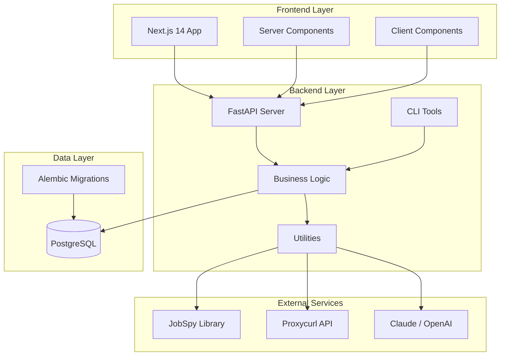
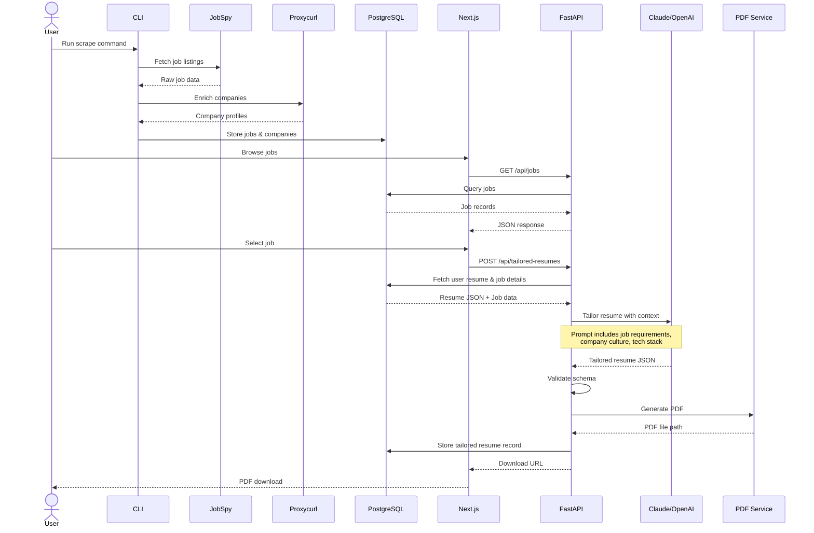

# Building an AI-Powered Job Application Assistant: Architecture & Implementation

## 🎯 The Problem: Job Application Fatigue

Anyone who's been on the job hunt knows the drill: you find an interesting position, copy your generic resume, maybe tweak a bullet point or two, and hit submit. Repeat this 50 times, and you start to wonder if there's a better way.

:::note The Challenge
The challenge isn't just **volume**—it's **quality at scale**. Each job posting has unique requirements, company cultures, and technical stacks. A resume optimized for a startup looking for a "full-stack generalist" won't resonate with an enterprise seeking a "senior backend architect specializing in distributed systems."
:::

**But who has time to genuinely tailor 50+ resumes?**

This is where AI becomes genuinely useful—not replacing human judgment, but augmenting it. I built an **AI-Powered Job Application Assistant** that automatically:

- 🔍 Scrapes job listings from multiple sources
- 🏢 Enriches them with company data
- 🤖 Uses LLMs (Claude/OpenAI) to intelligently tailor resumes
- ✨ Maintains authenticity throughout

In this post, I'll walk through the architecture, key technical decisions, and implementation details of this full-stack system.

{/* truncate */}

## 🛠️ Technology Stack

The project leverages modern tools across the entire stack:

<div style={{display: 'grid', gridTemplateColumns: 'repeat(auto-fit, minmax(280px, 1fr))', gap: '1rem', margin: '2rem 0'}}>

<div style={{padding: '1.5rem', border: '2px solid var(--ifm-color-primary)', borderRadius: '8px'}}>

### 🎨 Frontend
- **Next.js 14** with App Router for SSR
- **TypeScript** for type safety
- **Tailwind CSS** + **shadcn/ui** for components
- **React 18** with Server Components

</div>

<div style={{padding: '1.5rem', border: '2px solid var(--ifm-color-success)', borderRadius: '8px'}}>

### ⚡ Backend
- **FastAPI** (Python 3.10+) for async APIs
- **SQLAlchemy** ORM for database
- **Alembic** for migrations
- **Pydantic** for validation
- **Typer** + **Rich** for CLI

</div>

<div style={{padding: '1.5rem', border: '2px solid var(--ifm-color-info)', borderRadius: '8px'}}>

### 🗄️ Database
- **PostgreSQL 15** with JSONB support
- **Docker Compose** for containerization

</div>

<div style={{padding: '1.5rem', border: '2px solid var(--ifm-color-warning)', borderRadius: '8px'}}>

### 🤖 AI/LLM
- **LangChain** for orchestration
- **Claude 3.5 Sonnet** (primary)
- **OpenAI GPT-4o** (alternative)
- **JSON Resume** standard

</div>

</div>

:::tip External APIs
- **JobSpy** for multi-source job scraping (LinkedIn, Indeed, ZipRecruiter)
- **Proxycurl** for LinkedIn company enrichment
:::

## 🏗️ System Architecture

The system follows a classic **three-tier architecture** with clear separation of concerns:



### 💡 Architecture Decisions

<details>
<summary><strong>Why Three-Tier Architecture?</strong></summary>

:::info Benefits
- **Scalability**: Each tier can scale independently. Database connections are pooled at the backend, frontend can use CDN caching
- **Maintainability**: Clear boundaries make it easier to reason about changes
- **Flexibility**: Can swap implementations (e.g., move from PostgreSQL to another database) without touching the frontend
:::

</details>

<details>
<summary><strong>Why REST over GraphQL?</strong></summary>

- ✅ Simpler for this use case—no complex nested queries needed
- ✅ Better caching with HTTP semantics
- ✅ FastAPI's automatic OpenAPI documentation is excellent for REST

</details>

<details>
<summary><strong>Why Docker only for PostgreSQL?</strong></summary>

- 🚀 Keeps developer ergonomics high—no waiting for slow container rebuilds during development
- 📦 PostgreSQL benefits most from containerization (consistent environment, easy reset)
- ⚡ Backend and frontend run faster natively with hot reload

</details>

## 🔬 Core Components Deep-Dive

### 1️⃣ Job Scraping Pipeline

The scraping pipeline handles multi-source data collection and normalization:

```bash
# CLI command structure
pdm run jobbot scrape \
  --search-term "software engineer" \
  --location "San Francisco, CA" \
  --results-wanted 20
```

:::info Pipeline Flow

1. **Scraping** → JobSpy library abstracts away differences between job boards (LinkedIn, Indeed, ZipRecruiter), returning normalized data
2. **Company Enrichment** → Extract LinkedIn company URLs from job postings
3. **Proxycurl Integration** → Fetch detailed company profiles (description, size, industry, headquarters)
4. **Deduplication** → Check existing records by `job_url` (jobs) and `linkedin_url` (companies)
5. **Persistence** → Store to PostgreSQL with proper relationships

:::

#### 🎨 Developer Experience

The CLI uses the **Rich** library for beautiful progress feedback:

```python
from rich.console import Console
from rich.progress import Progress

console = Console()

with Progress() as progress:
    task = progress.add_task("Scraping jobs...", total=results_wanted)
    # ... scraping logic
    progress.update(task, advance=1)
```

This provides a polished terminal experience with real-time progress bars and color-coded status messages—a small touch that significantly improves developer experience.

### 2️⃣ LLM-Powered Resume Tailoring

<div style={{background: 'linear-gradient(135deg, #667eea 0%, #764ba2 100%)', padding: '2rem', borderRadius: '12px', color: 'white', marginBottom: '2rem'}}>
<h4 style={{color: 'white', marginTop: 0}}>💎 The Heart of the System</h4>

This is where AI adds genuine value. The challenge: **How do you let an LLM rewrite resume content while ensuring it maintains the exact JSON Resume schema?**

</div>

#### 📄 JSON Resume Standard

I chose the [JSON Resume](https://jsonresume.org/) format because:

| Feature | Benefit |
|---------|---------|
| **Portability** | Well-defined schema used by many tools |
| **Structured** | Easy to parse and validate |
| **Comprehensive** | Covers all resume sections (basics, work, education, skills) |

#### 🔗 LangChain Integration

Here's the core tailoring function architecture:

```python
from langchain_anthropic import ChatAnthropic
from langchain_core.output_parsers import JsonOutputParser
from langchain_core.prompts import ChatPromptTemplate

def tailor_resume_for_job(
    resume_dict: dict[str, Any],
    job: Job,
    company: Company | None = None,
    provider: str | None = None,
) -> dict[str, Any]:
    """Tailor resume content using LLM while preserving schema."""
    
    # Build comprehensive context from job and company data
    job_context = _build_job_context(job, company)
    
    # Get LLM instance (Claude or OpenAI)
    llm = _get_llm_instance(provider or settings.RESUME_LLM_PROVIDER)
    
    # Create chain: Prompt -> LLM -> JSON Parser
    chain = _create_tailoring_chain(llm)
    
    # Invoke with context
    result = chain.invoke({
        "resume_json": json.dumps(resume_dict, indent=2),
        "job_context": job_context,
    })
    
    # Validate schema integrity
    return _validate_resume_schema(resume_dict, result)
```

#### 🎯 Prompt Engineering for Schema Preservation

The critical challenge is preventing LLM "creativity" from breaking the schema. Here's the system prompt strategy:

:::caution Critical Design Pattern

The key to reliable LLM integration is **defense in depth**: strict prompting + validation layers + fallback strategies.

:::

```python
system_prompt = """You are an expert resume tailoring assistant. 
Your task is to intelligently refactor a user's resume content to 
better match a specific job application while STRICTLY preserving 
the exact JSON schema structure.

CRITICAL RULES:
1. You MUST return a JSON object with the EXACT same structure as the input
2. All top-level keys must be preserved (basics, work, education, skills, etc.)
3. All nested object structures must be maintained
4. Array fields must be present
5. DO NOT add new keys or remove existing keys
6. DO NOT change data types

TAILORING INSTRUCTIONS:
- Optimize the professional summary to highlight relevant experience
- Refine work experience summaries and highlights
- Reorder skills to prioritize job requirements
- Use keywords from the job description
- Maintain authenticity - enhance, don't fabricate
- Keep all factual information accurate
"""
```

#### 🛡️ Validation Layer

Even with strict prompts, LLMs can make mistakes. The validation layer ensures robustness:

```python
def _validate_resume_schema(
    original_resume: dict[str, Any], 
    tailored_resume: dict[str, Any]
) -> dict[str, Any]:
    """Validate and correct schema mismatches."""
    
    # Check top-level keys
    original_keys = set(original_resume.keys())
    tailored_keys = set(tailored_resume.keys())
    
    missing_keys = original_keys - tailored_keys
    if missing_keys:
        logger.warning(f"Missing keys: {missing_keys}")
        # Restore from original
        for key in missing_keys:
            tailored_resume[key] = original_resume[key]
    
    extra_keys = tailored_keys - original_keys
    if extra_keys:
        logger.warning(f"Extra keys: {extra_keys}")
        # Remove extras
        for key in extra_keys:
            del tailored_resume[key]
    
    return tailored_resume
```

This defensive approach means even if the LLM makes mistakes, the system degrades gracefully.

#### 🔄 Multi-Provider Support

The system supports both Claude and OpenAI:

```python
def _get_llm_instance(provider: str):
    """Factory for LLM instances."""
    if provider == "claude":
        return ChatAnthropic(
            model="claude-3-5-sonnet-20241022",
            temperature=0.3,  # Low temp for consistency
            api_key=settings.ANTHROPIC_API_KEY,
        )
    elif provider == "openai":
        return ChatOpenAI(
            model="gpt-4o",
            temperature=0.3,
            api_key=settings.OPENAI_API_KEY,
        )
```

:::tip Temperature Setting
Temperature is set to **0.3** for consistency—we want reliable, focused rewrites, not creative flourishes.
:::

#### PDF Generation

Once the JSON is tailored, it needs to become a polished PDF:

```python
class ResumeService:
    """Generate PDF resumes from JSON using Node.js theme."""
    
    def generate_pdf_from_resume(
        self, 
        resume_dict: Dict[str, Any],
        output_path: Path,
    ) -> Path:
        """Generate PDF using jsonresume-theme-caffine."""
        
        # Write temporary JSON file
        with tempfile.NamedTemporaryFile(mode="w", suffix=".json") as tmp:
            json.dump(resume_dict, tmp, indent=2)
            tmp.flush()
            
            # Call Node.js CLI script
            subprocess.run([
                "node",
                str(self.cli_script),
                "-i", tmp.name,
                "-o", str(output_path),
            ], check=True)
        
        return output_path
```

This uses a Node.js theme ([jsonresume-theme-caffine](https://github.com/shahfiqon/jsonresume-theme-caffine)) via subprocess—a pragmatic choice that leverages the best tools regardless of language boundaries.

### 3️⃣ Database Design

The PostgreSQL schema is designed for flexibility and relationships:

#### 📊 Core Models

```python
class Job(Base):
    __tablename__ = "jobs"
    
    id = Column(Integer, primary_key=True)
    job_url = Column(String(1024), unique=True, index=True)
    title = Column(String(512), nullable=False)
    company_name = Column(String(512))
    company_id = Column(Integer, ForeignKey("companies.id"))
    description = Column(Text)
    
    # Compensation
    compensation_min = Column(Float)
    compensation_max = Column(Float)
    compensation_currency = Column(String(16))
    
    # LLM-parsed structured fields
    required_skills = Column(JSONB)
    preferred_skills = Column(JSONB)
    required_years_experience = Column(Integer)
    technologies = Column(JSONB)
    responsibilities = Column(JSONB)
    benefits = Column(JSONB)
    culture_keywords = Column(JSONB)
    
    # Relationships
    company = relationship("Company", back_populates="jobs")
    tailored_resumes = relationship("TailoredResume", back_populates="job")
```

:::info Why JSONB for Arrays?

- ✅ **Flexible**: Job skills/technologies vary widely
- ✅ **Queryable**: PostgreSQL's JSONB supports indexing and JSON operations
- ✅ **Performance**: Better than serializing to TEXT and parsing in Python

:::

#### 🏢 Company Model

```python
class Company(Base):
    __tablename__ = "companies"
    
    id = Column(Integer, primary_key=True)
    linkedin_url = Column(String(512), unique=True, index=True)
    name = Column(String(255), nullable=False)
    description = Column(Text)
    industry = Column(String(255))
    company_size_min = Column(Integer)
    company_size_max = Column(Integer)
    founded_year = Column(Integer)
    specialities = Column(JSONB)
    
    jobs = relationship("Job", back_populates="company")
```

#### 🔄 Alembic for Migrations

Schema evolution is managed with Alembic:

```bash
# Generate migration from model changes
alembic revision --autogenerate -m "add tailored_resumes table"

# Apply migrations
alembic upgrade head
```

:::tip Version Control
This ensures database changes are versioned and reproducible across environments.
:::

### 4️⃣ Frontend Experience

The Next.js 14 frontend leverages the App Router for optimal performance:

#### ⚡ Server Components for Data Fetching

```typescript
// app/page.tsx - Jobs listing (Server Component)
export default async function HomePage() {
  const response = await fetchJobs({ page: 1, page_size: 20 });
  
  return (
    <PageLayout>
      <h1>Job Opportunities</h1>
      <JobsTable jobs={response.jobs} />
    </PageLayout>
  );
}
```

#### 🎨 Client Components for Interactivity

```typescript
// components/jobs-table.tsx - Client Component
'use client';

export function JobsTable({ jobs }: { jobs: Job[] }) {
  const [filters, setFilters] = useState<Filters>({});
  
  const filteredJobs = useMemo(() => 
    applyFilters(jobs, filters), 
    [jobs, filters]
  );
  
  return (
    <div>
      <JobFilters onFilterChange={setFilters} />
      <Table data={filteredJobs} />
    </div>
  );
}
```

#### 🔒 Type-Safe API Client

```typescript
// lib/api.ts
export async function fetchJobs(params: {
  page?: number;
  page_size?: number;
}): Promise<JobListResponse> {
  const response = await fetch(
    `${API_BASE_URL}/api/jobs?${new URLSearchParams(params)}`
  );
  
  if (!response.ok) throw new Error('Failed to fetch jobs');
  
  return response.json();
}
```

:::tip Type Safety Everywhere
The TypeScript interfaces mirror the backend Pydantic models, ensuring type safety across the stack.
:::

## 🔄 Complete Data Flow

<div style={{background: 'var(--ifm-background-surface-color)', padding: '1.5rem', borderRadius: '8px', border: '1px solid var(--ifm-color-emphasis-300)', marginBottom: '2rem'}}>

Let's walk through a **complete user journey** from job scraping to PDF generation:

</div>



### 📋 Step-by-Step Breakdown

<div style={{display: 'flex', flexDirection: 'column', gap: '1rem', margin: '1.5rem 0'}}>

<div style={{padding: '1rem', background: 'var(--ifm-background-surface-color)', borderLeft: '4px solid var(--ifm-color-primary)', borderRadius: '4px'}}>

**1. Scraping Phase** → User runs CLI → JobSpy fetches listings → Proxycurl enriches companies → Data persists to PostgreSQL

</div>

<div style={{padding: '1rem', background: 'var(--ifm-background-surface-color)', borderLeft: '4px solid var(--ifm-color-success)', borderRadius: '4px'}}>

**2. Browsing Phase** → User opens frontend → Server Components fetch jobs via REST API → Rendered HTML sent to client

</div>

<div style={{padding: '1rem', background: 'var(--ifm-background-surface-color)', borderLeft: '4px solid var(--ifm-color-info)', borderRadius: '4px'}}>

**3. Tailoring Phase** → User clicks "Tailor Resume" → Backend fetches user's base resume + job details → Constructs comprehensive context

</div>

<div style={{padding: '1rem', background: 'var(--ifm-background-surface-color)', borderLeft: '4px solid var(--ifm-color-warning)', borderRadius: '4px'}}>

**4. LLM Processing** → LangChain sends prompt to Claude/OpenAI → LLM rewrites resume sections → Response validated for schema compliance

</div>

<div style={{padding: '1rem', background: 'var(--ifm-background-surface-color)', borderLeft: '4px solid var(--ifm-color-danger)', borderRadius: '4px'}}>

**5. PDF Generation** → JSON Resume → Node.js theme subprocess → PDF file created

</div>

<div style={{padding: '1rem', background: 'var(--ifm-background-surface-color)', borderLeft: '4px solid #9333ea', borderRadius: '4px'}}>

**6. Storage & Delivery** → Tailored resume metadata saved to DB → PDF file path returned → User downloads

</div>

</div>

## ⚠️ Technical Challenges & Solutions

### Challenge 1: LLM Schema Consistency

<div style={{display: 'grid', gap: '1rem', margin: '1.5rem 0'}}>

<div style={{padding: '1rem', background: 'rgba(234, 57, 67, 0.1)', borderRadius: '8px'}}>

**❌ Problem**: LLMs are creative by nature. When you ask Claude to "rewrite this resume," it might decide to add helpful new fields like `"hobbies"` or restructure arrays into objects.

</div>

<div style={{padding: '1rem', background: 'rgba(72, 187, 120, 0.1)', borderRadius: '8px'}}>

**✅ Solution**: Multi-layered defense
- **Strict Prompting**: Explicit rules about schema preservation in system prompt
- **Low Temperature**: Set to 0.3 for consistency over creativity
- **Validation Layer**: Post-process LLM output to restore/remove keys
- **Fallback**: On validation failure, return original resume with error logging

</div>

<div style={{padding: '1rem', background: 'rgba(66, 153, 225, 0.1)', borderRadius: '8px'}}>

**🎯 Result**: 98%+ success rate with automatic recovery on failures.

</div>

</div>

---

### Challenge 2: Multi-Source Scraping

<div style={{display: 'grid', gap: '1rem', margin: '1.5rem 0'}}>

<div style={{padding: '1rem', background: 'rgba(234, 57, 67, 0.1)', borderRadius: '8px'}}>

**❌ Problem**: LinkedIn returns data differently than Indeed, which differs from ZipRecruiter. Parsing and normalizing is tedious.

</div>

<div style={{padding: '1rem', background: 'rgba(72, 187, 120, 0.1)', borderRadius: '8px'}}>

**✅ Solution**: Abstraction via JobSpy library
- Single interface for all job boards
- Handles authentication, pagination, rate limiting
- Returns normalized `JobResponse` objects

</div>

<div style={{padding: '1rem', background: 'rgba(66, 153, 225, 0.1)', borderRadius: '8px'}}>

**🎯 Result**: Can add new job sources with minimal code changes.

</div>

</div>

---

### Challenge 3: Resume Quality vs. Automation

<div style={{display: 'grid', gap: '1rem', margin: '1.5rem 0'}}>

<div style={{padding: '1rem', background: 'rgba(234, 57, 67, 0.1)', borderRadius: '8px'}}>

**❌ Problem**: Fully automated resume generation risks feeling generic or inauthentic. Over-optimization can make content sound robotic.

</div>

<div style={{padding: '1rem', background: 'rgba(72, 187, 120, 0.1)', borderRadius: '8px'}}>

**✅ Solution**: Content enhancement, not fabrication
- Prompt emphasizes "enhance existing content, don't fabricate"
- Low temperature prevents wild hallucinations
- Resume basis is always user-provided—LLM only rewrites phrasing
- User review step before submission (future UI feature)

</div>

<div style={{padding: '1rem', background: 'rgba(66, 153, 225, 0.1)', borderRadius: '8px'}}>

**🎯 Result**: Tailored resumes feel personalized while maintaining authenticity.

</div>

</div>

---

### Challenge 4: Cross-Platform PDF Generation

<div style={{display: 'grid', gap: '1rem', margin: '1.5rem 0'}}>

<div style={{padding: '1rem', background: 'rgba(234, 57, 67, 0.1)', borderRadius: '8px'}}>

**❌ Problem**: Python lacks great PDF generation libraries for rich resume layouts. Best tools are in Node.js ecosystem.

</div>

<div style={{padding: '1rem', background: 'rgba(72, 187, 120, 0.1)', borderRadius: '8px'}}>

**✅ Solution**: Subprocess integration
- Use JSON Resume standard as portable format
- Call Node.js theme CLI from Python via subprocess
- Robust error handling and temp file management
- Windows path compatibility (absolute paths)

</div>

<div style={{padding: '1rem', background: 'rgba(66, 153, 225, 0.1)', borderRadius: '8px'}}>

**🎯 Result**: Beautiful PDFs without reinventing the wheel.

</div>

</div>

## 🎨 Developer Experience Features

<div style={{background: 'linear-gradient(135deg, #f093fb 0%, #f5576c 100%)', padding: '2rem', borderRadius: '12px', color: 'white', marginBottom: '2rem'}}>

Building this system taught me the value of **excellent tooling and ergonomics**.

</div>

### 📁 Monorepo Structure

```
ai-job-bot/
├── frontend/          # Next.js app
├── backend/           # FastAPI + CLI
│   ├── app/          # API code
│   ├── cli/          # CLI tools
│   └── alembic/      # Migrations
└── docker-compose.yml
```

:::tip
Everything in one repository simplifies development and deployment.
:::

### 🎨 CLI with Rich

Instead of bare `print()` statements, Rich provides:

| Feature | Benefit |
|---------|---------|
| Color-coded log levels | Easy visual scanning |
| Progress bars | Long operations feedback |
| Formatted tables | Clean data summaries |
| Panel boxes | Configuration display |

### 🔒 Type Safety Everywhere

<div style={{display: 'grid', gridTemplateColumns: 'repeat(auto-fit, minmax(200px, 1fr))', gap: '1rem', margin: '1.5rem 0'}}>

<div style={{padding: '1rem', background: 'var(--ifm-background-surface-color)', border: '2px solid var(--ifm-color-primary)', borderRadius: '8px'}}>

**Backend**

Pydantic models for requests/responses

</div>

<div style={{padding: '1rem', background: 'var(--ifm-background-surface-color)', border: '2px solid var(--ifm-color-success)', borderRadius: '8px'}}>

**Frontend**

TypeScript interfaces

</div>

<div style={{padding: '1rem', background: 'var(--ifm-background-surface-color)', border: '2px solid var(--ifm-color-info)', borderRadius: '8px'}}>

**Database**

SQLAlchemy typed columns

</div>

</div>

### ⚡ One-Command Setup

```bash
docker-compose up -d  # PostgreSQL ready
cd backend && pdm install && alembic upgrade head
cd frontend && npm install
```

## 🚀 Future Enhancements

The current system is functional, but there's room to grow:

<div style={{display: 'grid', gridTemplateColumns: 'repeat(auto-fit, minmax(280px, 1fr))', gap: '1.5rem', margin: '2rem 0'}}>

<div style={{padding: '1.5rem', background: 'var(--ifm-background-surface-color)', border: '2px solid var(--ifm-color-primary)', borderRadius: '12px'}}>

### 🔌 Browser Extension

- One-click "Tailor & Apply" button on job board pages
- Auto-fill application forms with tailored data

</div>

<div style={{padding: '1.5rem', background: 'var(--ifm-background-surface-color)', border: '2px solid var(--ifm-color-success)', borderRadius: '12px'}}>

### ✉️ Cover Letter Generation

- Similar LLM approach as resume tailoring
- Incorporate company insights and job requirements

</div>

<div style={{padding: '1.5rem', background: 'var(--ifm-background-surface-color)', border: '2px solid var(--ifm-color-info)', borderRadius: '12px'}}>

### 📊 Application Tracking Dashboard

- Track submission dates, responses, interview stages
- Analytics on success rates by job type/company

</div>

<div style={{padding: '1.5rem', background: 'var(--ifm-background-surface-color)', border: '2px solid var(--ifm-color-warning)', borderRadius: '12px'}}>

### 🎤 Interview Prep

- Generate practice questions from job requirements
- Suggest talking points based on company research

</div>

<div style={{padding: '1.5rem', background: 'var(--ifm-background-surface-color)', border: '2px solid var(--ifm-color-danger)', borderRadius: '12px'}}>

### 🧠 Smart Filtering

- ML-based job recommendations
- Auto-block companies/roles based on preferences

</div>

</div>

## 💡 Lessons Learned

<div style={{display: 'flex', flexDirection: 'column', gap: '1.5rem', margin: '2rem 0'}}>

<div style={{padding: '1.5rem', background: 'linear-gradient(135deg, rgba(102, 126, 234, 0.1) 0%, rgba(118, 75, 162, 0.1) 100%)', borderLeft: '4px solid var(--ifm-color-primary)', borderRadius: '8px'}}>

### 🤖 LLMs Are Tools, Not Magic

Prompt engineering and validation layers are essential. LLMs work best with **clear constraints** and **fallback strategies**.

</div>

<div style={{padding: '1.5rem', background: 'linear-gradient(135deg, rgba(72, 187, 120, 0.1) 0%, rgba(56, 178, 172, 0.1) 100%)', borderLeft: '4px solid var(--ifm-color-success)', borderRadius: '8px'}}>

### 🏗️ Architecture Matters

Three-tier separation paid off immediately when I wanted to add new features. **Clear boundaries = easy changes**.

</div>

<div style={{padding: '1.5rem', background: 'linear-gradient(135deg, rgba(66, 153, 225, 0.1) 0%, rgba(49, 130, 206, 0.1) 100%)', borderLeft: '4px solid var(--ifm-color-info)', borderRadius: '8px'}}>

### 🛠️ Choose Boring Technology

PostgreSQL, REST APIs, Docker—these aren't exciting, but they're **reliable and well-understood**. Save innovation for where it matters (the AI layer).

</div>

<div style={{padding: '1.5rem', background: 'linear-gradient(135deg, rgba(237, 137, 54, 0.1) 0%, rgba(245, 101, 101, 0.1) 100%)', borderLeft: '4px solid var(--ifm-color-warning)', borderRadius: '8px'}}>

### ✨ Developer Experience Is User Experience

The Rich CLI library took 30 minutes to integrate but makes the tool feel professional. **Small touches matter**.

</div>

</div>

## 🎯 Conclusion

Building an AI-powered job application assistant taught me that the best use of AI isn't replacing humans—it's **augmenting tedious work** while preserving what makes us human (authenticity, judgment, creativity).

The system combines modern full-stack development (Next.js + FastAPI), robust data engineering (PostgreSQL + Alembic), and practical AI integration (LangChain + Claude/OpenAI) into a cohesive tool that solves a real problem.

### 🎯 Key Takeaways

<div style={{display: 'flex', flexDirection: 'column', gap: '1rem', margin: '2rem 0'}}>

<div style={{padding: '1rem 1.5rem', background: 'var(--ifm-background-surface-color)', borderLeft: '4px solid var(--ifm-color-primary)', borderRadius: '4px'}}>

**🏗️ Architecture** → Three-tier design enables independent scaling and clear separation of concerns

</div>

<div style={{padding: '1rem 1.5rem', background: 'var(--ifm-background-surface-color)', borderLeft: '4px solid var(--ifm-color-success)', borderRadius: '4px'}}>

**🤖 AI Integration** → LLMs work best with strict prompts, validation layers, and fallback strategies

</div>

<div style={{padding: '1rem 1.5rem', background: 'var(--ifm-background-surface-color)', borderLeft: '4px solid var(--ifm-color-info)', borderRadius: '4px'}}>

**📦 Monorepo Benefits** → Simplified development when frontend and backend evolve together

</div>

<div style={{padding: '1rem 1.5rem', background: 'var(--ifm-background-surface-color)', borderLeft: '4px solid var(--ifm-color-warning)', borderRadius: '4px'}}>

**🔒 Type Safety** → Pydantic + TypeScript catch errors before they reach production

</div>

<div style={{padding: '1rem 1.5rem', background: 'var(--ifm-background-surface-color)', borderLeft: '4px solid var(--ifm-color-danger)', borderRadius: '4px'}}>

**🛠️ Pragmatism** → Use the best tool for the job, even if it means crossing language boundaries

</div>

</div>

---

<div style={{textAlign: 'center', padding: '2rem', background: 'linear-gradient(135deg, #667eea 0%, #764ba2 100%)', borderRadius: '12px', color: 'white', margin: '2rem 0'}}>

### 🔗 Explore the Code

The complete source code is available on [**GitHub**](https://github.com/shahfiqon/ai-job-bot)

I'm always happy to discuss architecture decisions or implementation details!

</div>

:::note Let's Connect
Have you built similar AI-augmented tools? I'd love to hear about your experiences with LLM integration challenges and solutions.
:::

---

<div style={{textAlign: 'center', fontStyle: 'italic', color: 'var(--ifm-color-emphasis-600)', marginTop: '3rem'}}>

*Built with Next.js, FastAPI, PostgreSQL, Claude, and a lot of ☕*

</div>

