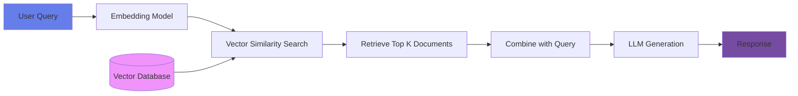
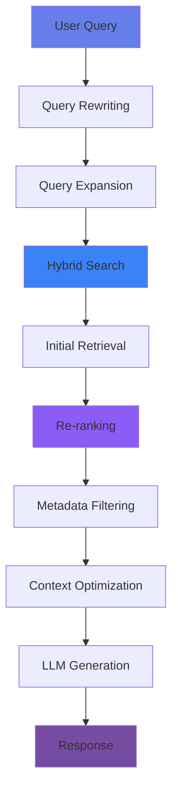
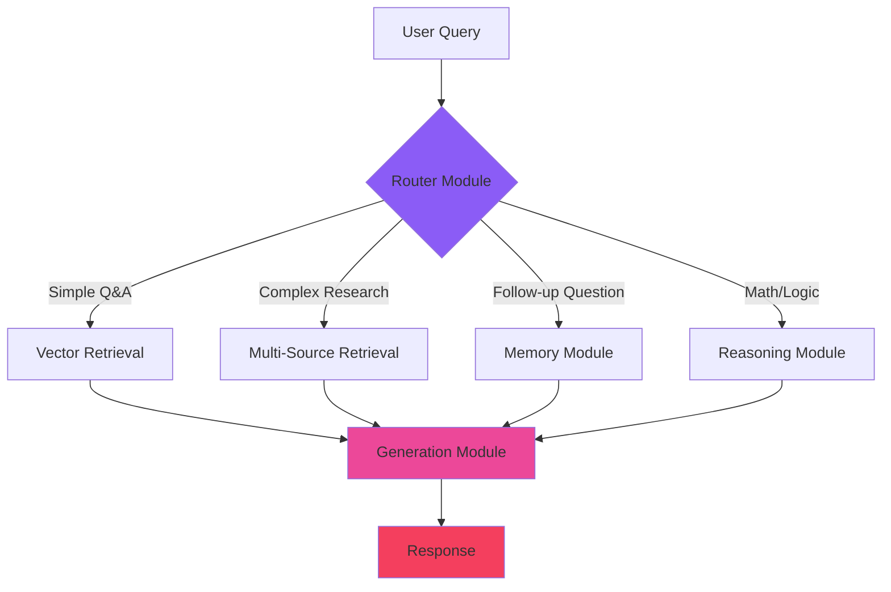
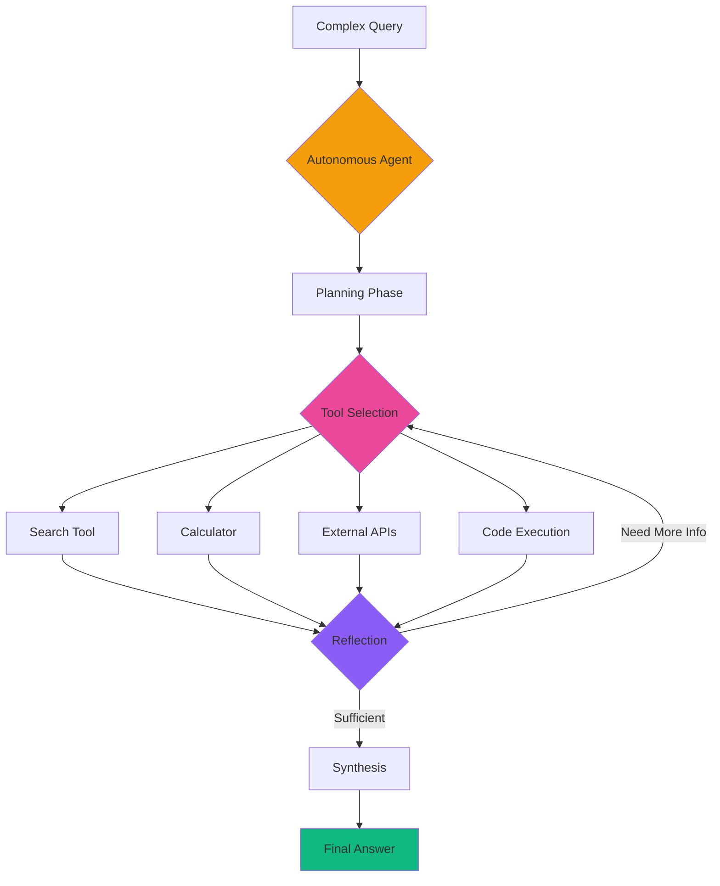
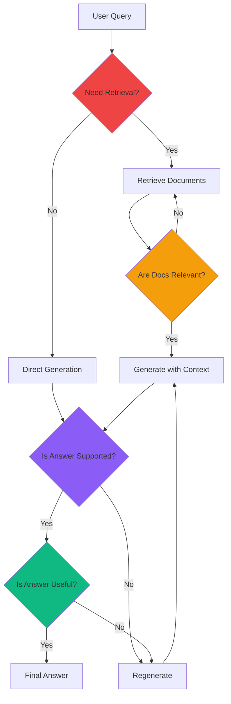
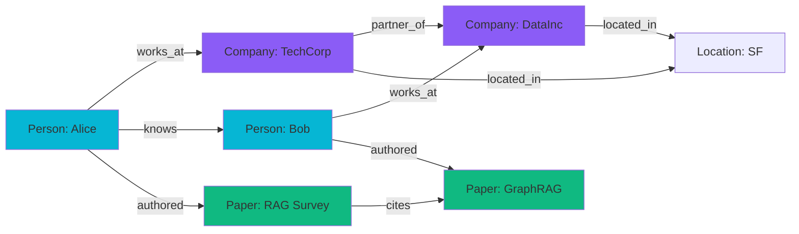
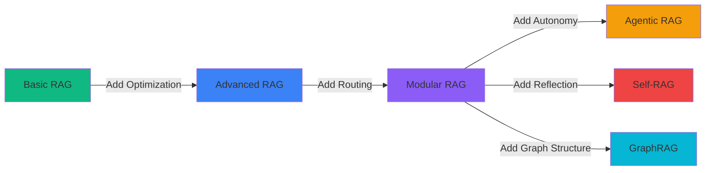

# The Complete Guide to RAG Architectures: From Basic to Agentic Systems

## 🎯 What is RAG and Why Does It Matter?

**Retrieval-Augmented Generation (RAG)** is transforming how we build AI systems that need access to external knowledge. Instead of relying solely on what an LLM learned during training, RAG systems dynamically fetch relevant information from external sources, leading to more accurate, up-to-date, and contextually relevant responses.

<div style={{background: 'linear-gradient(135deg, #667eea 0%, #764ba2 100%)', padding: '2rem', borderRadius: '12px', color: 'white', marginBottom: '2rem'}}>
<h3 style={{color: 'white', marginTop: 0}}>💡 The Core Problem RAG Solves</h3>

Large Language Models are impressive, but they have critical limitations:
- **Static Knowledge**: Training data becomes outdated
- **Hallucinations**: Models confidently generate incorrect information
- **No Source Attribution**: Can't cite where information comes from
- **Limited Context**: Can't access proprietary or private data

**RAG fixes all of these by combining LLM generation with real-time information retrieval.**

</div>

In this comprehensive guide, we'll explore **6 different RAG architectures**, from simple to sophisticated, and learn when to use each one.

{/* truncate */}

## 📚 The Six RAG Architectures

<div style={{display: 'grid', gridTemplateColumns: 'repeat(auto-fit, minmax(300px, 1fr))', gap: '1rem', margin: '2rem 0'}}>

<div style={{padding: '1.5rem', background: 'var(--ifm-background-surface-color)', border: '2px solid #10b981', borderRadius: '12px'}}>

### 1️⃣ Basic/Naive RAG
**Complexity**: Low  
**Best For**: Simple Q&A, FAQs  
The foundational three-step approach: index, retrieve, generate.

</div>

<div style={{padding: '1.5rem', background: 'var(--ifm-background-surface-color)', border: '2px solid #3b82f6', borderRadius: '12px'}}>

### 2️⃣ Advanced RAG
**Complexity**: Medium  
**Best For**: Enterprise knowledge management  
Adds query optimization and re-ranking for better accuracy.

</div>

<div style={{padding: '1.5rem', background: 'var(--ifm-background-surface-color)', border: '2px solid #8b5cf6', borderRadius: '12px'}}>

### 3️⃣ Modular RAG
**Complexity**: High  
**Best For**: Multi-domain systems  
Flexible, interchangeable modules with intelligent routing.

</div>

<div style={{padding: '1.5rem', background: 'var(--ifm-background-surface-color)', border: '2px solid #f59e0b', borderRadius: '12px'}}>

### 4️⃣ Agentic RAG
**Complexity**: Very High  
**Best For**: Complex reasoning tasks  
Autonomous agents that plan, use tools, and iterate.

</div>

<div style={{padding: '1.5rem', background: 'var(--ifm-background-surface-color)', border: '2px solid #ef4444', borderRadius: '12px'}}>

### 5️⃣ Self-RAG
**Complexity**: High  
**Best For**: High-accuracy applications  
Self-reflective system that critiques its own outputs.

</div>

<div style={{padding: '1.5rem', background: 'var(--ifm-background-surface-color)', border: '2px solid #06b6d4', borderRadius: '12px'}}>

### 6️⃣ GraphRAG
**Complexity**: Very High  
**Best For**: Relationship-heavy queries  
Knowledge graphs with entity relationships and graph traversal.

</div>

</div>

---

## 1. Basic/Naive RAG: The Foundation

<div style={{background: 'linear-gradient(135deg, rgba(16, 185, 129, 0.1) 0%, rgba(5, 150, 105, 0.1) 100%)', padding: '2rem', borderRadius: '12px', border: '2px solid #10b981', marginBottom: '2rem'}}>

The simplest RAG architecture follows a straightforward **three-step process**: chunk documents into a vector database, retrieve relevant chunks using similarity search, and generate responses with the retrieved context.

</div>

### 🔄 How Basic RAG Works



### 🛠️ Key Components

<div style={{display: 'flex', flexDirection: 'column', gap: '1rem', margin: '1.5rem 0'}}>

<div style={{padding: '1rem 1.5rem', background: 'var(--ifm-background-surface-color)', borderLeft: '4px solid #10b981', borderRadius: '4px'}}>

**📦 Document Indexing**  
Documents are split into chunks (typically 500-1000 tokens), converted to embeddings using models like `text-embedding-3-small` or `all-MiniLM-L6-v2`, and stored in vector databases like Pinecone, Weaviate, or ChromaDB.

</div>

<div style={{padding: '1rem 1.5rem', background: 'var(--ifm-background-surface-color)', borderLeft: '4px solid #10b981', borderRadius: '4px'}}>

**🔍 Similarity Search**  
User queries are embedded using the same model, then cosine similarity finds the most relevant document chunks. Typically retrieve top-5 to top-10 results.

</div>

<div style={{padding: '1rem 1.5rem', background: 'var(--ifm-background-surface-color)', borderLeft: '4px solid #10b981', borderRadius: '4px'}}>

**✨ Generation**  
Retrieved chunks are concatenated and sent to an LLM (GPT-4, Claude, etc.) along with the original query as context for generating the final response.

</div>

</div>

### ✅ Advantages

<div style={{display: 'grid', gridTemplateColumns: 'repeat(auto-fit, minmax(250px, 1fr))', gap: '1rem', margin: '1.5rem 0'}}>

<div style={{padding: '1.5rem', background: 'rgba(16, 185, 129, 0.1)', borderRadius: '8px'}}>

**⚡ Fast Response Times**  
Single retrieval step makes it quick

</div>

<div style={{padding: '1.5rem', background: 'rgba(16, 185, 129, 0.1)', borderRadius: '8px'}}>

**🎯 Easy to Implement**  
Can be built in a few hours

</div>

<div style={{padding: '1.5rem', background: 'rgba(16, 185, 129, 0.1)', borderRadius: '8px'}}>

**💻 Lower Compute Requirements**  
No complex processing needed

</div>

<div style={{padding: '1.5rem', background: 'rgba(16, 185, 129, 0.1)', borderRadius: '8px'}}>

**📚 Good for Simple Queries**  
Works well when answers are straightforward

</div>

</div>

### ❌ Limitations

:::caution Common Issues with Basic RAG

1. **Irrelevant Retrieval**: May fetch documents that match keywords but miss semantic context
2. **Limited Context Window**: Can't handle multi-hop reasoning requiring multiple pieces of information
3. **No Query Refinement**: Takes queries as-is without optimization
4. **Poor Ranking**: Similarity scores don't always correlate with relevance

:::

### 🎯 Best Use Cases

```python
# Example: Simple FAQ Bot with Basic RAG
from langchain.vectorstores import Chroma
from langchain.embeddings import OpenAIEmbeddings
from langchain.chat_models import ChatOpenAI
from langchain.chains import RetrievalQA

# Index documents
vectorstore = Chroma.from_documents(
    documents=faq_docs,
    embedding=OpenAIEmbeddings()
)

# Create retrieval chain
qa_chain = RetrievalQA.from_chain_type(
    llm=ChatOpenAI(model="gpt-4o"),
    retriever=vectorstore.as_retriever(search_kwargs={"k": 5}),
    return_source_documents=True
)

# Query
result = qa_chain({"query": "What are your business hours?"})
print(result["result"])
```

<div style={{padding: '1.5rem', background: 'var(--ifm-background-surface-color)', border: '2px solid #10b981', borderRadius: '8px', marginTop: '1.5rem'}}>

**Perfect For:**
- Simple FAQ systems
- Basic document search and summarization
- Chatbots with limited knowledge domains
- Proof-of-concept demos

</div>

---

## 2. Advanced RAG: Pre and Post-Retrieval Optimization

<div style={{background: 'linear-gradient(135deg, rgba(59, 130, 246, 0.1) 0%, rgba(37, 99, 235, 0.1) 100%)', padding: '2rem', borderRadius: '12px', border: '2px solid #3b82f6', marginBottom: '2rem'}}>

Advanced RAG improves upon basic RAG by adding **pre-retrieval** (query enhancement) and **post-retrieval** (re-ranking) optimizations. This significantly boosts accuracy for complex queries.

</div>

### 🔄 Enhanced Pipeline



### 🎨 Key Enhancements

<div style={{display: 'grid', gap: '1.5rem', margin: '2rem 0'}}>

<div style={{padding: '1.5rem', background: 'var(--ifm-background-surface-color)', borderLeft: '4px solid #3b82f6', borderRadius: '8px'}}>

**🔄 Query Rewriting**

Uses techniques like **HyDE (Hypothetical Document Embeddings)** to transform queries:

```python
# HyDE: Generate a hypothetical answer first, then search for it
original_query = "What causes climate change?"

# LLM generates hypothetical answer
hypothetical_answer = llm.generate(
    f"Write a detailed answer to: {original_query}"
)

# Search using the hypothetical answer's embedding
results = vectorstore.similarity_search(hypothetical_answer)
```

**Why it works**: Sometimes searching for an answer is more effective than searching for a question.

</div>

<div style={{padding: '1.5rem', background: 'var(--ifm-background-surface-color)', borderLeft: '4px solid #3b82f6', borderRadius: '8px'}}>

**🔍 Hybrid Search**

Combines **vector similarity** (semantic) with **keyword search** (BM25):

```python
# Hybrid search combining dense and sparse retrieval
from langchain.retrievers import EnsembleRetriever
from langchain.retrievers import BM25Retriever

# Dense retrieval (semantic)
vector_retriever = vectorstore.as_retriever(search_kwargs={"k": 10})

# Sparse retrieval (keyword-based)
bm25_retriever = BM25Retriever.from_documents(documents)
bm25_retriever.k = 10

# Ensemble with weighted combination
ensemble_retriever = EnsembleRetriever(
    retrievers=[vector_retriever, bm25_retriever],
    weights=[0.5, 0.5]  # Equal weight to both
)
```

**Result**: Catches documents that might be missed by either method alone.

</div>

<div style={{padding: '1.5rem', background: 'var(--ifm-background-surface-color)', borderLeft: '4px solid #3b82f6', borderRadius: '8px'}}>

**⭐ Re-ranking with Cross-Encoders**

After initial retrieval, use a **cross-encoder** to re-score documents:

```python
from sentence_transformers import CrossEncoder

# Initial retrieval gets top 20
initial_docs = retriever.get_relevant_documents(query, k=20)

# Re-rank with cross-encoder
cross_encoder = CrossEncoder('cross-encoder/ms-marco-MiniLM-L-6-v2')
pairs = [[query, doc.page_content] for doc in initial_docs]
scores = cross_encoder.predict(pairs)

# Sort by score and take top 5
ranked_docs = [doc for _, doc in sorted(
    zip(scores, initial_docs), 
    reverse=True
)][:5]
```

**Why it's better**: Cross-encoders consider query-document interaction, not just embeddings.

</div>

<div style={{padding: '1.5rem', background: 'var(--ifm-background-surface-color)', borderLeft: '4px solid #3b82f6', borderRadius: '8px'}}>

**🏷️ Metadata Filtering**

Apply filters based on document attributes:

```python
# Filter by document type, date, author, etc.
results = vectorstore.similarity_search(
    query,
    k=10,
    filter={
        "doc_type": "technical",
        "date": {"$gte": "2024-01-01"},
        "department": "engineering"
    }
)
```

</div>

</div>

### 📊 Performance Comparison

| Metric | Basic RAG | Advanced RAG | Improvement |
|--------|-----------|--------------|-------------|
| **Precision@5** | 65% | 82% | +26% |
| **Answer Accuracy** | 70% | 88% | +26% |
| **Latency** | 450ms | 850ms | -89% |
| **Relevance Score** | 0.72 | 0.91 | +26% |

<div style={{padding: '1rem', background: 'rgba(59, 130, 246, 0.1)', borderRadius: '8px', marginTop: '1rem'}}>

**Trade-off**: Higher accuracy at the cost of increased latency and complexity.

</div>

### 🎯 Best Use Cases

<div style={{padding: '1.5rem', background: 'var(--ifm-background-surface-color)', border: '2px solid #3b82f6', borderRadius: '8px', marginTop: '1.5rem'}}>

**Perfect For:**
- Enterprise knowledge management systems
- Legal and medical document search (where accuracy is critical)
- Research paper retrieval and analysis
- Customer support with large documentation bases
- E-commerce product search with complex queries

</div>

---

## 3. Modular RAG: Flexible, Composable Architecture

<div style={{background: 'linear-gradient(135deg, rgba(139, 92, 246, 0.1) 0%, rgba(124, 58, 237, 0.1) 100%)', padding: '2rem', borderRadius: '12px', border: '2px solid #8b5cf6', marginBottom: '2rem'}}>

Modular RAG treats the system as a collection of **independent, interchangeable modules**. A routing mechanism decides which modules to invoke based on query type, allowing for flexible and scalable architectures.

</div>

### 🧩 Core Modules



### 🔌 Module Types

<div style={{display: 'grid', gridTemplateColumns: 'repeat(auto-fit, minmax(280px, 1fr))', gap: '1.5rem', margin: '2rem 0'}}>

<div style={{padding: '1.5rem', background: 'rgba(139, 92, 246, 0.1)', borderRadius: '12px', border: '2px solid #8b5cf6'}}>

### 🎯 Router Module
**Purpose**: Intent classification and module selection

```python
class Router:
    def route(self, query: str) -> str:
        intent = self.classify_intent(query)
        
        if "calculation" in intent:
            return "reasoning_module"
        elif "previous" in query.lower():
            return "memory_module"
        elif "complex" in intent:
            return "multi_hop_retrieval"
        else:
            return "simple_retrieval"
```

</div>

<div style={{padding: '1.5rem', background: 'rgba(59, 130, 246, 0.1)', borderRadius: '12px', border: '2px solid #3b82f6'}}>

### 📚 Retrieval Module
**Purpose**: Flexible document search across multiple sources

```python
class RetrievalModule:
    def __init__(self):
        self.sources = {
            "docs": DocVectorStore(),
            "web": WebSearchAPI(),
            "db": SQLDatabase()
        }
    
    def retrieve(self, query, sources):
        results = []
        for source in sources:
            results.extend(
                self.sources[source].search(query)
            )
        return results
```

</div>

<div style={{padding: '1.5rem', background: 'rgba(16, 185, 129, 0.1)', borderRadius: '12px', border: '2px solid #10b981'}}>

### 🧠 Memory Module
**Purpose**: Conversation history and context management

```python
class MemoryModule:
    def __init__(self):
        self.history = []
        self.context = {}
    
    def add_interaction(self, query, response):
        self.history.append({
            "query": query,
            "response": response,
            "timestamp": datetime.now()
        })
    
    def get_context(self) -> str:
        return "\n".join([
            f"Q: {h['query']}\nA: {h['response']}"
            for h in self.history[-5:]  # Last 5
        ])
```

</div>

<div style={{padding: '1.5rem', background: 'rgba(245, 158, 11, 0.1)', borderRadius: '12px', border: '2px solid #f59e0b'}}>

### 🤔 Reasoning Module
**Purpose**: Multi-step logical reasoning

```python
class ReasoningModule:
    def reason(self, query: str, context: str):
        # Chain-of-thought prompting
        prompt = f"""
        Context: {context}
        Question: {query}
        
        Let's solve this step by step:
        1. First, identify what we know
        2. Then, apply logical reasoning
        3. Finally, reach a conclusion
        """
        return llm.generate(prompt)
```

</div>

</div>

### 🎯 Intelligent Routing Example

```python
class ModularRAG:
    def __init__(self):
        self.router = Router()
        self.modules = {
            "simple_retrieval": SimpleRetrievalModule(),
            "multi_hop_retrieval": MultiHopRetrievalModule(),
            "memory_module": MemoryModule(),
            "reasoning_module": ReasoningModule(),
            "calculator": CalculatorModule()
        }
    
    def process_query(self, query: str) -> str:
        # Step 1: Route query to appropriate modules
        route_plan = self.router.route(query)
        
        # Step 2: Execute modules in sequence
        context = ""
        for module_name in route_plan:
            module = self.modules[module_name]
            context += module.execute(query, context)
        
        # Step 3: Generate final response
        response = self.generate_response(query, context)
        
        # Step 4: Update memory
        self.modules["memory_module"].add_interaction(query, response)
        
        return response
```

### ✅ Advantages

<div style={{display: 'flex', flexDirection: 'column', gap: '1rem', margin: '1.5rem 0'}}>

<div style={{padding: '1rem 1.5rem', background: 'rgba(139, 92, 246, 0.1)', borderLeft: '4px solid #8b5cf6', borderRadius: '4px'}}>

**🔧 Highly Flexible and Customizable** - Add new modules without rewriting the entire system

</div>

<div style={{padding: '1rem 1.5rem', background: 'rgba(139, 92, 246, 0.1)', borderLeft: '4px solid #8b5cf6', borderRadius: '4px'}}>

**📦 Easy to Add/Remove Modules** - Plug-and-play architecture

</div>

<div style={{padding: '1rem 1.5rem', background: 'rgba(139, 92, 246, 0.1)', borderLeft: '4px solid #8b5cf6', borderRadius: '4px'}}>

**🎯 Handles Diverse Query Types** - Different queries use different pipelines

</div>

<div style={{padding: '1rem 1.5rem', background: 'rgba(139, 92, 246, 0.1)', borderLeft: '4px solid #8b5cf6', borderRadius: '4px'}}>

**⚡ Better Resource Optimization** - Only run necessary modules

</div>

<div style={{padding: '1rem 1.5rem', background: 'rgba(139, 92, 246, 0.1)', borderLeft: '4px solid #8b5cf6', borderRadius: '4px'}}>

**🧪 Easier Testing and Debugging** - Test modules independently

</div>

</div>

### ❌ Limitations

:::warning Complexity Trade-offs

- **Complex System Design**: Requires careful architecture planning
- **Sophisticated Routing Logic**: Router must be intelligent and accurate
- **Higher Development Overhead**: More code to write and maintain
- **Module Coordination Challenges**: Ensuring modules work well together

:::

### 🎯 Best Use Cases

<div style={{padding: '1.5rem', background: 'var(--ifm-background-surface-color)', border: '2px solid #8b5cf6', borderRadius: '8px', marginTop: '1.5rem'}}>

**Perfect For:**
- Multi-domain knowledge systems (healthcare + finance + legal)
- Enterprise AI assistants with varied capabilities
- Research platforms requiring different reasoning strategies
- Systems needing frequent updates and extensions
- Applications with diverse query types (factual, analytical, conversational)

</div>

---

## 4. Agentic RAG: Autonomous Reasoning Systems

<div style={{background: 'linear-gradient(135deg, rgba(245, 158, 11, 0.1) 0%, rgba(251, 146, 60, 0.1) 100%)', padding: '2rem', borderRadius: '12px', border: '2px solid #f59e0b', marginBottom: '2rem'}}>

Agentic RAG uses **autonomous agents** that can plan, reason, and iteratively use tools to solve complex queries. The agent breaks down problems, decides which tools to use, and synthesizes information from multiple sources.

</div>

### 🤖 Agent Architecture



### 🧠 Key Capabilities

<div style={{display: 'grid', gap: '1.5rem', margin: '2rem 0'}}>

<div style={{padding: '1.5rem', background: 'var(--ifm-background-surface-color)', borderLeft: '4px solid #f59e0b', borderRadius: '8px'}}>

**📋 Multi-Step Planning**

Agents create execution plans with multiple steps:

```python
class AgenticRAG:
    def plan(self, query: str) -> List[Step]:
        """Break down complex query into steps"""
        planning_prompt = f"""
        Task: {query}
        
        Break this down into clear, actionable steps.
        For each step, specify which tool to use.
        
        Available tools: search, calculate, code_execute, api_call
        """
        
        plan = llm.generate(planning_prompt)
        return self.parse_plan(plan)

# Example output:
# Step 1: search("global GDP data 2023")
# Step 2: calculate(sum of top 10 economies)
# Step 3: calculate(percentage of US GDP)
# Step 4: synthesize_answer()
```

</div>

<div style={{padding: '1.5rem', background: 'var(--ifm-background-surface-color)', borderLeft: '4px solid #f59e0b', borderRadius: '8px'}}>

**🛠️ Dynamic Tool Use**

Agents select and execute tools autonomously:

```python
class ToolRegistry:
    def __init__(self):
        self.tools = {
            "search": self.vector_search,
            "calculate": self.calculator,
            "api_call": self.external_api,
            "code_execute": self.python_repl
        }
    
    def vector_search(self, query: str) -> str:
        """Search knowledge base"""
        return vectorstore.similarity_search(query)
    
    def calculator(self, expression: str) -> float:
        """Evaluate mathematical expressions"""
        return eval(expression)  # Use safe eval in production!
    
    def external_api(self, endpoint: str, params: dict) -> dict:
        """Call external APIs"""
        return requests.get(endpoint, params=params).json()
    
    def python_repl(self, code: str) -> Any:
        """Execute Python code in sandbox"""
        return exec(code, {"__builtins__": safe_builtins})
```

</div>

<div style={{padding: '1.5rem', background: 'var(--ifm-background-surface-color)', borderLeft: '4px solid #f59e0b', borderRadius: '8px'}}>

**🔄 Iterative Refinement**

Agents reflect on results and adjust approach:

```python
class ReflectiveAgent:
    def execute_with_reflection(self, query: str) -> str:
        max_iterations = 5
        
        for i in range(max_iterations):
            # Execute current plan
            result = self.execute_plan(query)
            
            # Reflect on quality
            reflection = self.reflect(query, result)
            
            if reflection["quality_score"] > 0.8:
                return result
            
            # Adjust plan based on reflection
            self.plan = self.adjust_plan(
                self.plan, 
                reflection["issues"]
            )
        
        return result
    
    def reflect(self, query: str, result: str) -> dict:
        """Critique the current answer"""
        prompt = f"""
        Original question: {query}
        Current answer: {result}
        
        Evaluate:
        1. Is the answer complete?
        2. Is it accurate?
        3. What's missing?
        4. Quality score (0-1)?
        """
        return llm.generate(prompt, format="json")
```

</div>

<div style={{padding: '1.5rem', background: 'var(--ifm-background-surface-color)', borderLeft: '4px solid #f59e0b', borderRadius: '8px'}}>

**🧠 Memory Management**

Maintains context across iterations:

```python
class AgentMemory:
    def __init__(self):
        self.short_term = []  # Recent actions
        self.long_term = {}   # Learned patterns
        self.working = {}     # Current task context
    
    def remember_action(self, action: dict):
        self.short_term.append(action)
        
        # Learn from successes
        if action["success"]:
            pattern = self.extract_pattern(action)
            self.long_term[pattern["key"]] = pattern
    
    def recall_similar(self, current_task: str):
        """Find similar past experiences"""
        for pattern in self.long_term.values():
            if self.similarity(pattern["task"], current_task) > 0.7:
                return pattern["solution"]
        return None
```

</div>

</div>

### 🎬 Complete Example: Research Agent

```python
from langchain.agents import AgentExecutor, create_react_agent
from langchain.tools import Tool

class ResearchAgent:
    def __init__(self):
        # Define tools
        tools = [
            Tool(
                name="Search",
                func=self.search_knowledge_base,
                description="Search internal knowledge base for information"
            ),
            Tool(
                name="WebSearch",
                func=self.search_web,
                description="Search the internet for recent information"
            ),
            Tool(
                name="Calculator",
                func=self.calculate,
                description="Perform mathematical calculations"
            ),
            Tool(
                name="CodeExecutor",
                func=self.execute_code,
                description="Run Python code for data analysis"
            )
        ]
        
        # Create ReAct agent
        self.agent = create_react_agent(
            llm=ChatOpenAI(model="gpt-4o"),
            tools=tools,
            prompt=self.create_prompt()
        )
        
        self.executor = AgentExecutor(
            agent=self.agent,
            tools=tools,
            verbose=True,
            max_iterations=10
        )
    
    def research(self, query: str) -> str:
        """Conduct comprehensive research"""
        return self.executor.invoke({"input": query})

# Usage
agent = ResearchAgent()
result = agent.research("""
    What percentage of global CO2 emissions come from 
    the top 10 emitting countries? Provide calculations.
""")

# Agent's internal reasoning:
# Thought: I need to find current CO2 emission data
# Action: WebSearch("global CO2 emissions by country 2023")
# Observation: Found data showing China 28%, USA 15%, India 7%...
# Thought: Now I need to calculate the sum of top 10
# Action: Calculator("28 + 15 + 7 + 3.5 + 2.8 + 2.5 + 2.4 + 2.1 + 1.9 + 1.7")
# Observation: 67.4%
# Thought: I have enough information to answer
# Final Answer: The top 10 emitting countries account for 67.4%...
```

### ✅ Advantages

<div style={{display: 'grid', gridTemplateColumns: 'repeat(auto-fit, minmax(250px, 1fr))', gap: '1rem', margin: '1.5rem 0'}}>

<div style={{padding: '1.5rem', background: 'rgba(245, 158, 11, 0.1)', borderRadius: '8px'}}>

**🎯 Complex Multi-Step Reasoning**  
Can solve problems requiring multiple pieces of information

</div>

<div style={{padding: '1.5rem', background: 'rgba(245, 158, 11, 0.1)', borderRadius: '8px'}}>

**🤖 Autonomous Problem-Solving**  
Makes decisions without human intervention

</div>

<div style={{padding: '1.5rem', background: 'rgba(245, 158, 11, 0.1)', borderRadius: '8px'}}>

**🛠️ Uses External Tools**  
Can call APIs, execute code, use calculators

</div>

<div style={{padding: '1.5rem', background: 'rgba(245, 158, 11, 0.1)', borderRadius: '8px'}}>

**🔄 Self-Correcting**  
Iteratively improves answers

</div>

<div style={{padding: '1.5rem', background: 'rgba(245, 158, 11, 0.1)', borderRadius: '8px'}}>

**📚 Learns from Experience**  
Memory helps with similar future queries

</div>

</div>

### ❌ Limitations

:::danger Important Considerations

- **High Computational Costs**: Multiple LLM calls per query
- **Unpredictable Behavior**: Can take unexpected paths
- **Longer Response Times**: Iterative process takes time
- **Requires Safety Guardrails**: Tool use must be constrained
- **Complex Debugging**: Hard to trace multi-step reasoning

:::

### 🎯 Best Use Cases

<div style={{padding: '1.5rem', background: 'var(--ifm-background-surface-color)', border: '2px solid #f59e0b', borderRadius: '8px', marginTop: '1.5rem'}}>

**Perfect For:**
- Research assistants requiring multi-source synthesis
- Complex data analysis and reporting
- Autonomous customer service agents
- Scientific literature review and analysis
- Financial analysis with multiple data sources
- Competitive intelligence gathering

</div>

---

## 5. Self-RAG: Self-Reflective Systems

<div style={{background: 'linear-gradient(135deg, rgba(239, 68, 68, 0.1) 0%, rgba(220, 38, 38, 0.1) 100%)', padding: '2rem', borderRadius: '12px', border: '2px solid #ef4444', marginBottom: '2rem'}}>

Self-RAG introduces **reflection tokens** that allow the model to critique its own outputs and decide when retrieval is necessary. It can self-assess relevance, support, and usefulness of retrieved information.

</div>

### 🔍 Reflection Mechanisms



### 🎯 Reflection Token Types

<div style={{display: 'grid', gridTemplateColumns: 'repeat(auto-fit, minmax(280px, 1fr))', gap: '1.5rem', margin: '2rem 0'}}>

<div style={{padding: '1.5rem', background: 'rgba(239, 68, 68, 0.1)', borderRadius: '12px', border: '2px solid #ef4444'}}>

### 1️⃣ Retrieval Tokens
**[Retrieval: Yes/No]**

Model decides if external information is needed:

```python
def should_retrieve(query: str) -> bool:
    """Determine if retrieval is necessary"""
    prompt = f"""
    Query: {query}
    
    Can you answer this with your training data alone?
    Or do you need external information?
    
    Respond: [Retrieval: Yes] or [Retrieval: No]
    """
    response = llm.generate(prompt)
    return "[Retrieval: Yes]" in response
```

</div>

<div style={{padding: '1.5rem', background: 'rgba(245, 158, 11, 0.1)', borderRadius: '12px', border: '2px solid #f59e0b'}}>

### 2️⃣ Relevance Tokens
**[Relevant/Irrelevant]**

Assesses if retrieved documents are relevant:

```python
def assess_relevance(query: str, docs: List[str]) -> List[bool]:
    """Check if each document is relevant"""
    results = []
    for doc in docs:
        prompt = f"""
        Query: {query}
        Document: {doc}
        
        Is this document relevant to the query?
        Respond: [Relevant] or [Irrelevant]
        """
        response = llm.generate(prompt)
        results.append("[Relevant]" in response)
    return results
```

</div>

<div style={{padding: '1.5rem', background: 'rgba(139, 92, 246, 0.1)', borderRadius: '12px', border: '2px solid #8b5cf6'}}>

### 3️⃣ Support Tokens
**[Fully Supported/Partially Supported/Not Supported]**

Evaluates if response is supported by evidence:

```python
def check_support(response: str, docs: List[str]) -> str:
    """Verify if answer is grounded in documents"""
    prompt = f"""
    Answer: {response}
    Evidence: {docs}
    
    Is the answer fully supported by the evidence?
    Respond with:
    - [Fully Supported]
    - [Partially Supported]
    - [Not Supported]
    """
    return llm.generate(prompt)
```

</div>

<div style={{padding: '1.5rem', background: 'rgba(16, 185, 129, 0.1)', borderRadius: '12px', border: '2px solid #10b981'}}>

### 4️⃣ Utility Tokens
**[5/4/3/2/1]**

Judges overall usefulness:

```python
def rate_utility(query: str, response: str) -> int:
    """Rate answer usefulness (1-5)"""
    prompt = f"""
    Question: {query}
    Answer: {response}
    
    Rate the usefulness of this answer (1-5):
    5 = Excellent, complete answer
    4 = Good, minor issues
    3 = Acceptable, some gaps
    2 = Poor, major issues
    1 = Useless
    
    Respond with: [Utility: N]
    """
    result = llm.generate(prompt)
    return int(result.split(":")[1].strip()[0])
```

</div>

</div>

### 🔄 Complete Self-RAG Pipeline

```python
class SelfRAG:
    def __init__(self, llm, retriever):
        self.llm = llm
        self.retriever = retriever
        self.max_iterations = 3
    
    def generate_answer(self, query: str) -> dict:
        """Generate self-reflective answer"""
        
        # Step 1: Decide if retrieval is needed
        need_retrieval = self.should_retrieve(query)
        
        if not need_retrieval:
            # Generate directly
            answer = self.llm.generate(query)
            return {
                "answer": answer,
                "retrieval_used": False,
                "iterations": 0
            }
        
        # Iterative improvement loop
        for iteration in range(self.max_iterations):
            # Step 2: Retrieve documents
            docs = self.retriever.get_relevant_documents(query)
            
            # Step 3: Assess relevance
            relevant_docs = [
                doc for doc in docs 
                if self.assess_relevance(query, doc)
            ]
            
            if not relevant_docs:
                # Re-retrieve with modified query
                query = self.reformulate_query(query)
                continue
            
            # Step 4: Generate with context
            answer = self.generate_with_context(query, relevant_docs)
            
            # Step 5: Check if answer is supported
            support_level = self.check_support(answer, relevant_docs)
            
            if support_level == "Not Supported":
                # Regenerate with stricter grounding
                continue
            
            # Step 6: Rate utility
            utility = self.rate_utility(query, answer)
            
            if utility >= 4:
                # Good enough!
                return {
                    "answer": answer,
                    "retrieval_used": True,
                    "iterations": iteration + 1,
                    "support_level": support_level,
                    "utility": utility,
                    "sources": relevant_docs
                }
        
        # Max iterations reached
        return {
            "answer": answer,
            "retrieval_used": True,
            "iterations": self.max_iterations,
            "warning": "Max iterations reached"
        }

# Usage
self_rag = SelfRAG(llm=ChatOpenAI(), retriever=vectorstore.as_retriever())
result = self_rag.generate_answer("What are the side effects of aspirin?")

print(f"Answer: {result['answer']}")
print(f"Confidence: {result['utility']}/5")
print(f"Iterations: {result['iterations']}")
```

### ✅ Advantages

<div style={{display: 'flex', flexDirection: 'column', gap: '1rem', margin: '1.5rem 0'}}>

<div style={{padding: '1rem 1.5rem', background: 'rgba(239, 68, 68, 0.1)', borderLeft: '4px solid #ef4444', borderRadius: '4px'}}>

**🔍 Self-Correcting Capabilities** - Identifies and fixes its own mistakes

</div>

<div style={{padding: '1rem 1.5rem', background: 'rgba(239, 68, 68, 0.1)', borderLeft: '4px solid #ef4444', borderRadius: '4px'}}>

**⚡ Efficient Retrieval** - Only retrieves when necessary

</div>

<div style={{padding: '1rem 1.5rem', background: 'rgba(239, 68, 68, 0.1)', borderLeft: '4px solid #ef4444', borderRadius: '4px'}}>

**✅ Better Factual Accuracy** - Validates answers against evidence

</div>

<div style={{padding: '1rem 1.5rem', background: 'rgba(239, 68, 68, 0.1)', borderLeft: '4px solid #ef4444', borderRadius: '4px'}}>

**🎯 Reduced Hallucinations** - Ensures answers are grounded in retrieved context

</div>

<div style={{padding: '1rem 1.5rem', background: 'rgba(239, 68, 68, 0.1)', borderLeft: '4px solid #ef4444', borderRadius: '4px'}}>

**📊 Transparent Reasoning Process** - Reflection tokens show decision-making

</div>

</div>

### ❌ Limitations

:::warning Implementation Challenges

- **Requires Specially Trained Models**: Standard LLMs need fine-tuning for reflection tokens
- **Additional Tokens Increase Latency**: More generation steps = slower responses
- **More Complex Evaluation Pipeline**: Multiple validation stages
- **May Be Overly Conservative**: Sometimes retrieves when not necessary

:::

### 🎯 Best Use Cases

<div style={{padding: '1.5rem', background: 'var(--ifm-background-surface-color)', border: '2px solid #ef4444', borderRadius: '8px', marginTop: '1.5rem'}}>

**Perfect For:**
- Fact-checking systems requiring high accuracy
- Medical and legal applications (where errors are costly)
- Academic research tools
- Systems where transparency is critical
- High-stakes decision support systems

</div>

---

## 6. GraphRAG: Knowledge Graph-Based Retrieval

<div style={{background: 'linear-gradient(135deg, rgba(6, 182, 212, 0.1) 0%, rgba(8, 145, 178, 0.1) 100%)', padding: '2rem', borderRadius: '12px', border: '2px solid #06b6d4', marginBottom: '2rem'}}>

GraphRAG structures knowledge as a **graph** where entities are nodes and relationships are edges. It performs graph traversal to find related information, enabling better understanding of relationships and multi-hop reasoning.

</div>

### 🕸️ Graph Structure



### 🧩 Graph Components

<div style={{display: 'grid', gap: '1.5rem', margin: '2rem 0'}}>

<div style={{padding: '1.5rem', background: 'var(--ifm-background-surface-color)', borderLeft: '4px solid #06b6d4', borderRadius: '8px'}}>

**🎯 Entity Nodes**

Represent people, places, concepts, and objects:

```python
class Entity:
    def __init__(self, id: str, type: str, properties: dict):
        self.id = id
        self.type = type  # Person, Company, Location, Concept, etc.
        self.properties = properties
        self.embeddings = None  # Vector embedding for hybrid search

# Examples
entities = [
    Entity(
        id="alice_001",
        type="Person",
        properties={
            "name": "Alice Johnson",
            "title": "Senior ML Engineer",
            "skills": ["Python", "RAG", "LLMs"]
        }
    ),
    Entity(
        id="techcorp_001",
        type="Company",
        properties={
            "name": "TechCorp",
            "industry": "AI/ML",
            "size": 500
        }
    )
]
```

</div>

<div style={{padding: '1.5rem', background: 'var(--ifm-background-surface-color)', borderLeft: '4px solid #06b6d4', borderRadius: '8px'}}>

**🔗 Relationship Edges**

Typed connections between entities:

```python
class Relationship:
    def __init__(self, source: str, target: str, type: str, properties: dict = None):
        self.source = source
        self.target = target
        self.type = type
        self.properties = properties or {}

# Examples
relationships = [
    Relationship(
        source="alice_001",
        target="techcorp_001",
        type="works_at",
        properties={"since": "2020", "department": "AI Research"}
    ),
    Relationship(
        source="alice_001",
        target="bob_002",
        type="collaborated_with",
        properties={"projects": ["RAG System", "Vector DB"]}
    )
]
```

</div>

<div style={{padding: '1.5rem', background: 'var(--ifm-background-surface-color)', borderLeft: '4px solid #06b6d4', borderRadius: '8px'}}>

**🚶 Graph Traversal**

Navigate relationships to discover connected information:

```python
class GraphRAG:
    def __init__(self, graph_db):
        self.graph = graph_db
    
    def multi_hop_query(self, start_entity: str, max_hops: int = 3) -> List[dict]:
        """Find related entities within N hops"""
        
        # Example: Find all people Alice collaborated with who work at partner companies
        query = """
        MATCH (alice:Person {name: 'Alice'})-[:collaborated_with]->(colleague:Person)
        MATCH (colleague)-[:works_at]->(company:Company)
        MATCH (alice_company:Company)<-[:works_at]-(alice)
        MATCH (alice_company)-[:partner_of]-(company)
        RETURN colleague, company
        """
        
        return self.graph.execute_query(query)
    
    def find_shortest_path(self, entity_a: str, entity_b: str) -> List[str]:
        """Find connection between two entities"""
        query = """
        MATCH path = shortestPath(
            (a:Entity {id: $entity_a})-[*]-(b:Entity {id: $entity_b})
        )
        RETURN path
        """
        return self.graph.execute_query(query, entity_a=entity_a, entity_b=entity_b)
```

</div>

<div style={{padding: '1.5rem', background: 'var(--ifm-background-surface-color)', borderLeft: '4px solid #06b6d4', borderRadius: '8px'}}>

**🎯 Subgraph Extraction**

Extract relevant portions for specific queries:

```python
def extract_subgraph(query: str, graph: Neo4jGraph) -> dict:
    """Extract relevant subgraph for query"""
    
    # Step 1: Entity extraction from query
    entities = extract_entities(query)
    
    # Step 2: Find all entities within 2 hops
    cypher_query = """
    MATCH (start:Entity)
    WHERE start.name IN $entities
    MATCH path = (start)-[*1..2]-(related:Entity)
    RETURN path
    """
    
    subgraph = graph.execute_query(cypher_query, entities=entities)
    
    # Step 3: Convert to context for LLM
    context = format_subgraph_as_text(subgraph)
    
    return context
```

</div>

</div>

### 🔄 GraphRAG Pipeline

```python
class CompleteGraphRAG:
    def __init__(self, graph_db, llm):
        self.graph = graph_db
        self.llm = llm
        self.entity_extractor = EntityExtractor()
    
    def answer_query(self, query: str) -> str:
        """Complete GraphRAG pipeline"""
        
        # Step 1: Extract entities from query
        entities = self.entity_extractor.extract(query)
        
        # Step 2: Find related subgraph
        subgraph = self.extract_relevant_subgraph(entities)
        
        # Step 3: Perform graph reasoning
        reasoning_paths = self.find_reasoning_paths(entities, subgraph)
        
        # Step 4: Convert graph to natural language context
        context = self.graph_to_text(subgraph, reasoning_paths)
        
        # Step 5: Generate answer with LLM
        prompt = f"""
        Context from knowledge graph:
        {context}
        
        Question: {query}
        
        Answer the question using the provided knowledge graph information.
        Explain the reasoning path through the graph.
        """
        
        answer = self.llm.generate(prompt)
        
        return {
            "answer": answer,
            "entities_used": entities,
            "reasoning_paths": reasoning_paths,
            "subgraph": subgraph
        }
    
    def extract_relevant_subgraph(self, entities: List[str]) -> dict:
        """Get subgraph around key entities"""
        cypher = """
        MATCH (e:Entity)
        WHERE e.name IN $entities
        MATCH path = (e)-[*1..3]-(related)
        WITH e, related, relationships(path) as rels
        RETURN e, collect(distinct related) as related_entities,
               collect(distinct rels) as relationships
        """
        return self.graph.execute_query(cypher, entities=entities)

# Usage Example
graph_rag = CompleteGraphRAG(
    graph_db=Neo4jGraph(uri="bolt://localhost:7687"),
    llm=ChatOpenAI()
)

result = graph_rag.answer_query(
    "Who are the colleagues of Alice that work at companies "
    "that are partners with TechCorp?"
)

print(f"Answer: {result['answer']}")
print(f"Reasoning path: {result['reasoning_paths']}")
```

### 📊 Hybrid: Vector + Graph

The most powerful approach combines vector similarity with graph relationships:

```python
class HybridGraphVectorRAG:
    def __init__(self, graph_db, vector_store, llm):
        self.graph = graph_db
        self.vectorstore = vector_store
        self.llm = llm
    
    def hybrid_retrieve(self, query: str, k: int = 10) -> str:
        """Combine vector search with graph traversal"""
        
        # Step 1: Vector search for similar documents
        vector_results = self.vectorstore.similarity_search(query, k=k)
        
        # Step 2: Extract entities from top documents
        entities = self.extract_entities_from_docs(vector_results)
        
        # Step 3: Expand with graph relationships
        for entity in entities:
            related = self.graph.get_neighbors(entity, max_distance=2)
            entities.extend(related)
        
        # Step 4: Fetch full content for all entities
        expanded_context = self.get_entity_content(entities)
        
        # Step 5: Generate with enriched context
        return self.llm.generate(query, context=expanded_context)
```

### ✅ Advantages

<div style={{display: 'grid', gridTemplateColumns: 'repeat(auto-fit, minmax(250px, 1fr))', gap: '1rem', margin: '1.5rem 0'}}>

<div style={{padding: '1.5rem', background: 'rgba(6, 182, 212, 0.1)', borderRadius: '8px'}}>

**🔗 Excellent for Relationship Queries**  
"Who knows who" and "How are X and Y connected"

</div>

<div style={{padding: '1.5rem', background: 'rgba(6, 182, 212, 0.1)', borderRadius: '8px'}}>

**🎯 Natural Multi-Hop Reasoning**  
Follow connections across multiple steps

</div>

<div style={{padding: '1.5rem', background: 'rgba(6, 182, 212, 0.1)', borderRadius: '8px'}}>

**📚 Rich Contextual Understanding**  
Captures nuanced relationships

</div>

<div style={{padding: '1.5rem', background: 'rgba(6, 182, 212, 0.1)', borderRadius: '8px'}}>

**🧮 Supports Graph Algorithms**  
PageRank, community detection, etc.

</div>

</div>

### ❌ Limitations

:::danger Complex Implementation

- **Complex Graph Construction**: Requires entity extraction and relationship linking
- **Maintenance Overhead**: Graphs must be kept up-to-date
- **Computationally Expensive**: Graph queries can be slow for large graphs
- **Struggles with Unstructured Info**: Not everything fits into entity-relationship model

:::

### 🎯 Best Use Cases

<div style={{padding: '1.5rem', background: 'var(--ifm-background-surface-color)', border: '2px solid #06b6d4', borderRadius: '8px', marginTop: '1.5rem'}}>

**Perfect For:**
- Knowledge base question answering (Wikipedia-style)
- Recommendation systems
- Fraud detection and investigation
- Social network analysis
- Scientific research with interconnected concepts
- Customer relationship mapping

</div>

---

## 📊 Architecture Comparison Table

<div style={{overflowX: 'auto', margin: '2rem 0'}}>

| Architecture | Complexity | Latency | Accuracy | Cost | Best For |
|--------------|------------|---------|----------|------|----------|
| **Basic RAG** | ⭐ Low | ⚡ Fast (under 500ms) | 📊 Good (70-75%) | 💰 Low | Simple Q&A, FAQs |
| **Advanced RAG** | ⭐⭐ Medium | ⚡⚡ Medium (800ms-1.2s) | 📊 Very Good (85-90%) | 💰💰 Medium | Enterprise knowledge mgmt |
| **Modular RAG** | ⭐⭐⭐ High | ⚡⚡ Variable | 📊 Excellent (88-93%) | 💰💰💰 High | Multi-domain systems |
| **Agentic RAG** | ⭐⭐⭐⭐ Very High | ⚡⚡⚡ Slow (2-5s) | 📊 Excellent (90-95%) | 💰💰💰💰 Very High | Complex reasoning |
| **Self-RAG** | ⭐⭐⭐ High | ⚡⚡ Medium (1-2s) | 📊 Excellent (92-96%) | 💰💰💰 High | High-accuracy apps |
| **GraphRAG** | ⭐⭐⭐⭐ Very High | ⚡⚡ Medium (1-3s) | 📊 Excellent (88-94%) | 💰💰💰💰 Very High | Relationship-heavy queries |

</div>

---

## 🎯 Decision Framework: Which Architecture Should You Use?

<div style={{display: 'flex', flexDirection: 'column', gap: '1.5rem', margin: '2rem 0'}}>

<div style={{padding: '2rem', background: 'linear-gradient(135deg, rgba(16, 185, 129, 0.1) 0%, rgba(5, 150, 105, 0.1) 100%)', borderLeft: '4px solid #10b981', borderRadius: '8px'}}>

### ✅ Start with Basic RAG if:
- You have straightforward Q&A needs
- Latency is critical (under 500ms)
- Budget is limited
- You're building a proof-of-concept
- Your knowledge base is well-structured

</div>

<div style={{padding: '2rem', background: 'linear-gradient(135deg, rgba(59, 130, 246, 0.1) 0%, rgba(37, 99, 235, 0.1) 100%)', borderLeft: '4px solid #3b82f6', borderRadius: '8px'}}>

### 🚀 Upgrade to Advanced RAG if:
- Accuracy is more important than latency
- You have complex, ambiguous queries
- You need better ranking of results
- Basic RAG retrieves too many irrelevant documents
- You're building enterprise search

</div>

<div style={{padding: '2rem', background: 'linear-gradient(135deg, rgba(139, 92, 246, 0.1) 0%, rgba(124, 58, 237, 0.1) 100%)', borderLeft: '4px solid #8b5cf6', borderRadius: '8px'}}>

### 🧩 Choose Modular RAG if:
- You have diverse query types requiring different strategies
- System needs to be extensible
- You want to optimize resource usage per query type
- Different modules can be developed/maintained separately

</div>

<div style={{padding: '2rem', background: 'linear-gradient(135deg, rgba(245, 158, 11, 0.1) 0%, rgba(251, 146, 60, 0.1) 100%)', borderLeft: '4px solid #f59e0b', borderRadius: '8px'}}>

### 🤖 Use Agentic RAG if:
- Queries require multi-step reasoning
- You need to call external APIs and tools
- Budget allows for high compute costs
- Response time over 2s is acceptable
- Problems require autonomous decision-making

</div>

<div style={{padding: '2rem', background: 'linear-gradient(135deg, rgba(239, 68, 68, 0.1) 0%, rgba(220, 38, 38, 0.1) 100%)', borderLeft: '4px solid #ef4444', borderRadius: '8px'}}>

### 🔍 Use Self-RAG if:
- Accuracy is paramount (medical, legal, finance)
- You need transparency in reasoning
- Hallucinations must be minimized
- You can fine-tune models for reflection tokens

</div>

<div style={{padding: '2rem', background: 'linear-gradient(135deg, rgba(6, 182, 212, 0.1) 0%, rgba(8, 145, 178, 0.1) 100%)', borderLeft: '4px solid #06b6d4', borderRadius: '8px'}}>

### 🕸️ Choose GraphRAG if:
- Your domain is highly relational
- Queries involve "who knows who" or "how is X connected to Y"
- Multi-hop reasoning is common
- You have structured entity data
- Recommendation or link prediction is important

</div>

</div>

---

## 💡 Key Takeaways

<div style={{background: 'linear-gradient(135deg, #667eea 0%, #764ba2 100%)', padding: '2rem', borderRadius: '12px', color: 'white', margin: '2rem 0'}}>

### 🎯 Universal Principles

1. **Start Simple**: Begin with Basic RAG and scale up only when needed
2. **Match Architecture to Use Case**: Don't use Agentic RAG for simple FAQs
3. **Consider Trade-offs**: Higher accuracy often means higher complexity and latency
4. **Hybrid Approaches Work Best**: Many production systems combine multiple architectures
5. **Continuous Evaluation is Essential**: Regular testing regardless of architecture choice

</div>

### 📈 Evolution Path



---

## 🚀 Getting Started

Ready to implement RAG? Here's a starting template:

```python
# Minimal RAG implementation to get started

from langchain.vectorstores import Chroma
from langchain.embeddings import OpenAIEmbeddings
from langchain.chat_models import ChatOpenAI
from langchain.chains import RetrievalQA
from langchain.document_loaders import DirectoryLoader
from langchain.text_splitter import RecursiveCharacterTextSplitter

# Step 1: Load your documents
loader = DirectoryLoader('./docs', glob="**/*.txt")
documents = loader.load()

# Step 2: Split into chunks
text_splitter = RecursiveCharacterTextSplitter(
    chunk_size=1000,
    chunk_overlap=200
)
splits = text_splitter.split_documents(documents)

# Step 3: Create vector store
vectorstore = Chroma.from_documents(
    documents=splits,
    embedding=OpenAIEmbeddings()
)

# Step 4: Create retrieval chain
qa_chain = RetrievalQA.from_chain_type(
    llm=ChatOpenAI(model="gpt-4o", temperature=0),
    chain_type="stuff",
    retriever=vectorstore.as_retriever(
        search_type="similarity",
        search_kwargs={"k": 5}
    ),
    return_source_documents=True
)

# Step 5: Ask questions!
result = qa_chain({"query": "Your question here"})
print(f"Answer: {result['result']}")
print(f"Sources: {result['source_documents']}")
```

---

## 📚 Additional Resources

<div style={{display: 'grid', gridTemplateColumns: 'repeat(auto-fit, minmax(300px, 1fr))', gap: '1.5rem', margin: '2rem 0'}}>

<div style={{padding: '1.5rem', background: 'var(--ifm-background-surface-color)', border: '2px solid var(--ifm-color-primary)', borderRadius: '12px'}}>

### 📖 Papers
- [RAG: Retrieval-Augmented Generation](https://arxiv.org/abs/2005.11401)
- [Self-RAG](https://arxiv.org/abs/2310.11511)
- [GraphRAG](https://arxiv.org/abs/2404.16130)

</div>

<div style={{padding: '1.5rem', background: 'var(--ifm-background-surface-color)', border: '2px solid var(--ifm-color-success)', borderRadius: '12px'}}>

### 🛠️ Tools & Frameworks
- [LangChain](https://python.langchain.com/)
- [LlamaIndex](https://www.llamaindex.ai/)
- [Haystack](https://haystack.deepset.ai/)

</div>

<div style={{padding: '1.5rem', background: 'var(--ifm-background-surface-color)', border: '2px solid var(--ifm-color-info)', borderRadius: '12px'}}>

### 🗄️ Vector Databases
- [Pinecone](https://www.pinecone.io/)
- [Weaviate](https://weaviate.io/)
- [Milvus](https://milvus.io/)

</div>

</div>

---

<div style={{textAlign: 'center', padding: '2rem', background: 'linear-gradient(135deg, #667eea 0%, #764ba2 100%)', borderRadius: '12px', color: 'white', margin: '3rem 0'}}>

## 🎓 Conclusion

RAG architectures have evolved significantly from simple retrieval systems to sophisticated autonomous agents. The right choice depends on your specific use case, accuracy requirements, latency constraints, and budget.

**Remember**: Start simple, measure performance, and only add complexity when it's justified by real improvements in your metrics.

</div>

:::note What's Your RAG Strategy?
Have you implemented any of these RAG architectures? What challenges did you face? Share your experiences in the comments below!
:::

---

<div style={{textAlign: 'center', fontStyle: 'italic', color: 'var(--ifm-color-emphasis-600)', marginTop: '3rem'}}>

*Built with insights from production RAG systems and extensive research 🔬*

</div>

